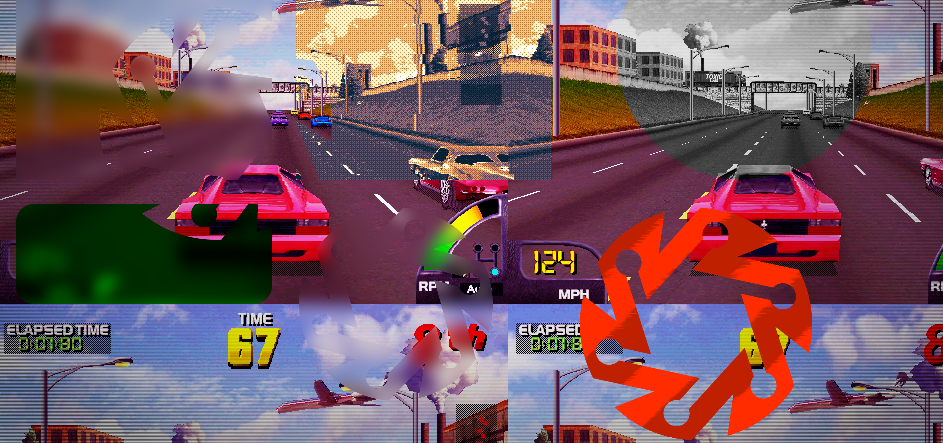

## Using Area Masks <!-- {docsify-ignore} -->

Area masks are areas of the screen on which you can draw only part of the post-processing. You can use sprites to crop the image, creating cool effects.



> This feature is intended for UI use.


## Creating glass effect for UI <!-- {docsify-ignore} -->

In this example, we will simulate glassmorphism. Basically you will create a system in the same way as the other examples. Placing the desired effects and then loading the profile.  
We're going to use Kawase Blur, which is the lightest blur effect.

In `Create Event`:
```gml
ui_blur_id = ppfx_create();
ppfx_set_draw_enable(ui_blur_id, false); // disable auto-draw of this system - because we will draw it manually, using the area functions!
var _profile_blur = ppfx_profile_create("Glass Blur", [
	new pp_blur_kawase(true, 0.4),
]);
ppfx_profile_load(ui_blur_id, _profile_blur);
```

</br>
Generally, you will already be using a post-processing system before, so you should use the main surface as a base to render the system used for blur:

In `Post-Draw` event:
```gml
var _pos = application_get_position();
var _xx = _pos[0];
var _yy = _pos[1];
var _ww = _pos[2]-_pos[0];
var _wh = _pos[3]-_pos[1];
var _vw = surface_get_width(application_surface);
var _vh = surface_get_height(application_surface);

// render main system from "Main"
ppfx_draw(application_surface, _xx, _yy, _ww, _wh, _vw, _vh, ppfx_id);

// render system from "Glass Blur", using main post-processing surface
ppfx_draw(ppfx_get_render_surface(ppfx_id), _xx, _yy, _ww, _wh, _vw, _vh, ui_blur_id);
```

</br>

## Drawing Simple Masks <!-- {docsify-ignore} -->

Still nothing will be displayed on the screen as we need to create clipping masks. For this we will use some functions. It is possible to use sprites or rectangles as a mask.

To draw a simple rectangular mask, use:

In `Draw GUI` event:
```gml
area_draw_rect(60, 60, 200, 200, 0, 0, ui_blur_id);
```
In the code above we used the blur system (Glass Blur).

So:


</br>

## Drawing Sprite Masks <!-- {docsify-ignore} -->

We've seen how to draw a basic rectangular mask. Now we'll see how to use your *own* sprite as a mask, giving you infinite customization possibilities!
The code is the same for the systems. Just now we will use the `area_draw_sprite_*` functions:

```gml
area_draw_sprite_ext_mask(spr_mask, 0, 100, 100, 1, 1, -current_time*0.1, c_aqua, 1, ui_blur_id);
```
You will draw the sprite like any other, you will just use the id of the post-processing system.

So:


Mask used:


</br>

### Rounded Rectangle Sprite Mask <!-- {docsify-ignore} -->

Usage:

```gml
area_draw_sprite_stretched_mask(spr_mask, 0, device_mouse_x_to_gui(0), device_mouse_y_to_gui(0), 300, 200, ui_blur_id);
```

So:


Mask used:


> Tip: You can enable the Nine Slices option on the sprite for a perfect glass!


This is it! :D


