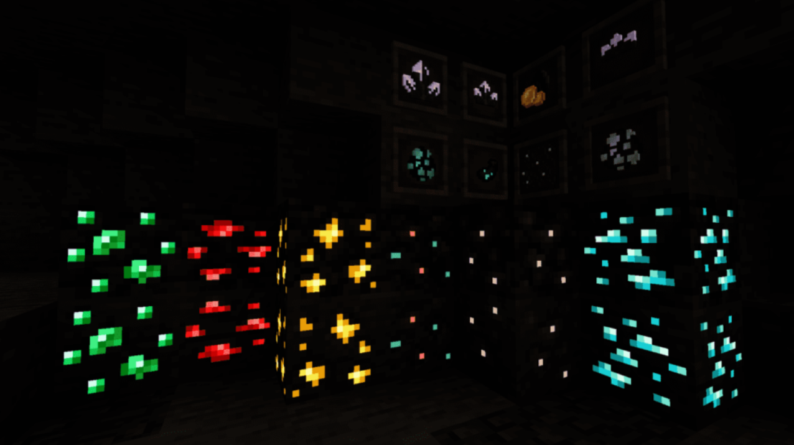

# Effects Informations

This page lists technical information for all the effects available in Post-Processing FX.

> Note: You can also see ALL effect information using Feather in GameMaker.


## Bloom

The Bloom effect makes emissive (bright) areas in your image glow, making a realistic simulation of light. The effect also has dirt-lens to simulate a dirty camera (optional).

Trust me, this effect can improve the look of your game a lot if set up right!




Yes! The bloom was created on top of the last image, without any additional editing, just Post-Processing FX!

### Properties <!-- {docsify-ignore} -->

```gml
FX_Bloom(enabled, iterations, threshold, knee, intensity, color, whiteAmount, dirtEnable, dirtTexture, dirtIntensity, dirtScale, dirtTiled, dirtCanDistort, resolution, debug1, debug2);
```

| Name | Description |  
|-----------|:-----------|  
| enabled | Defines whether the effect starts active or not. |  
| iterations | Sets Bloom’s scattering, which is how far the effect reaches. Max: 16. recommended: 4 to 8. |  
| threshold | Set the level of brightness to filter out pixels under this level. 0 above; 0 means full brightness. |  
| knee | Controls the softness of the transition between the bloomed and non-bloomed areas of the image. |  
| intensity | Set the strength of the Bloom filter. 0 to 5 recommended. There is not maximum amount. |  
| color | The color that is multiplied by the bloom's final color. Default is c_white. |  
| whiteAmount | How close to white Bloom will look, in very saturated colors. 1 is full white. |  
| dirtEnable | Defines whether to use dirt textures. |  
| dirtTexture | The texture id used for the Dirt Lens. Use sprite_get_texture() or surface_get_texture(). |  
| dirtIntensity | The intensity of Dirt Lens. 0 to 3 recommended. |  
| dirtScale | The scale of Dirt Lens. 0.25 to 3 recommended. |  
| dirtTiled | Defines whether the dirt lens will repeat seamlessly. |  
| dirtCanDistort | If active, the dirt texture will distort according to the lens distortion effect. |  
| resolution | Sets the resolution of the Bloom, this affects the performance. 1 is full resolution = more resources needed, but look better. 1 = full, 0.5 = falf. |  
| debug1 | Allows you to see the final bloom result alone. |  
| debug2 | Allows you to see exactly where the bloom is hitting the light parts. |  


### Details <!-- {docsify-ignore} -->

Dirt Lens is optional.

### Performance <!-- {docsify-ignore} -->

The number of **iterations** influences the amount of batch breaks and texture swaps. And high **resolution** influences in GPU usage.

</br></br>


# WIP...

I'll finish writing in another life lmao (_too many_ stuff to write here...)  

(You can see every detail of all effects using the Feather documentation, 
just hover your mouse over the effect functions).
