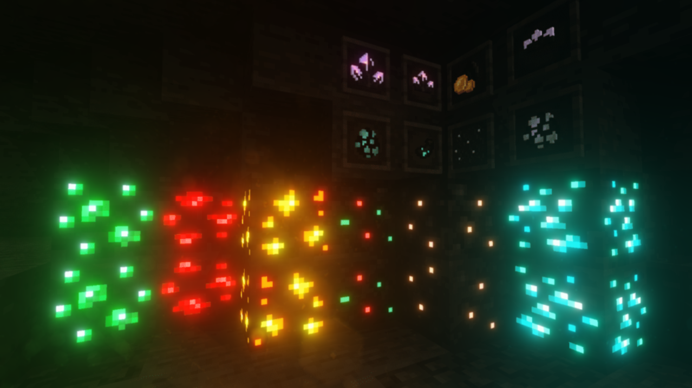
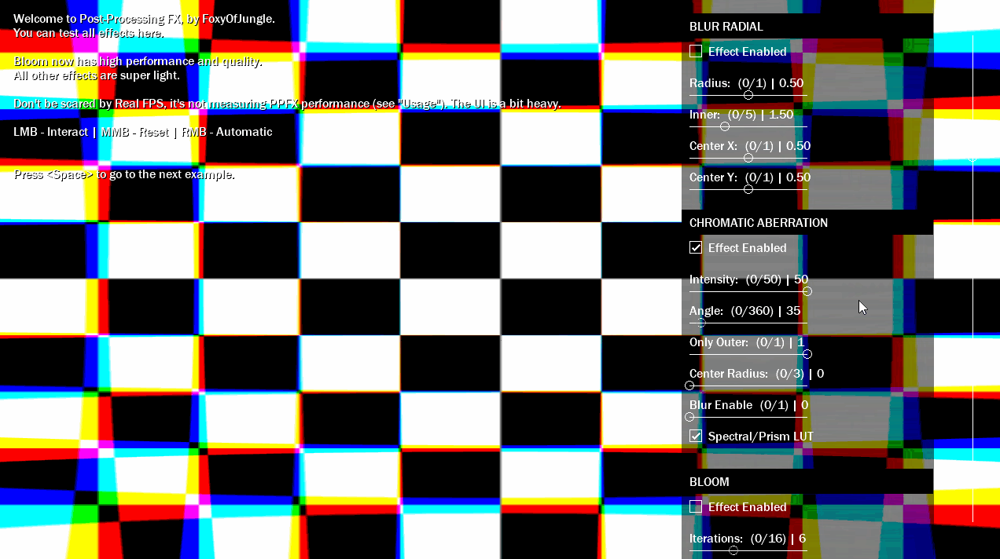

# Effects Informations

This page lists technical information for all the effects available in Post-Processing FX.


# Bloom

The Bloom effect makes bright areas in your image glow. To do this, it creates fringes of light that extend from bright areas in your image. This simulates the effect a real-world camera gives when light overwhelms the lens.

The Bloom effect also has a Dirt lens feature, which you can use to apply a full-screen layer of smudges or dust to diffract the Bloom effect.



## Properties <!-- {docsify-ignore} -->

```gml
pp_bloom(enabled, iterations, threshold, intensity, colorr, smooth_enable, reduce_banding, dirt_enable, dirt_texture, dirt_intensity, dirt_scale);
```

| Name | Description |  
|-----------|:-----------|  
| enabled | Defines whether the effect starts active or not. |  
| iterations | Sets Bloom's scattering, which is how far the effect reaches. |  
| threshold | Set the level of brightness to filter out pixels under this level. |  
| intensity | Set the strength of the Bloom filter. |  
| colorr | The color that is multiplied by the bloom's final color. |  
| smooth_enable | Sets whether bloom will use linear filter to be smoother. |  
| reduce_banding | Sets whether to reduce banding caused by colors. |  
| dirt_enable | Defines whether to use dirt textures. |  
| dirt_texture | The texture id used for the Dirt Lens. |  
| dirt_intensity | The intensity of Dirt Lens |  
| dirt_scale | The scale of Dirt Lens |  


## Details <!-- {docsify-ignore} -->

You don't need to use a Dirt Lens texture, just don't reference one. Disabling smooth enable can result in a low quality Bloom.

## Performance <!-- {docsify-ignore} -->

The number of **iterations** influences the amount of batch breaks and texture swaps. Enabling **reduce banding** costs a little more on the GPU.


<br><br><br><br>
# Chromatic Aberration

The Chromatic Aberration effect splits color along boundaries in an image into their red, green, and blue channels. This reproduces the effect a real-world camera produces when light refracts and causes the wavelengths to disperse in the lens.

PPFX provides support for red/blue and green/purple spectral. You can define spectral colors by using a LUT texture.



## Properties <!-- {docsify-ignore} -->

```gml
pp_chromaber(enabled, intensity, angle, only_outer, center_radius, blur_enable, prisma_lut_tex);
```

| Name | Description |  
|-----------|:-----------|  
| enabled | Defines whether the effect starts active or not. |  


WIP...


