# Effects Informations

This page shows what each Post-Processing FX effect looks like.

> Technical information about the effect parameters can be found within GameMaker using Feather (by hovering the mouse over the effect, for example FX_Bloom).


## Bloom

The Bloom effect makes emissive (bright) areas in your image glow, making a realistic simulation of light. The effect also has dirt-lens to simulate a dirty camera (optional).  

| Bloom + ACES Tone Mapping |  
|---|
|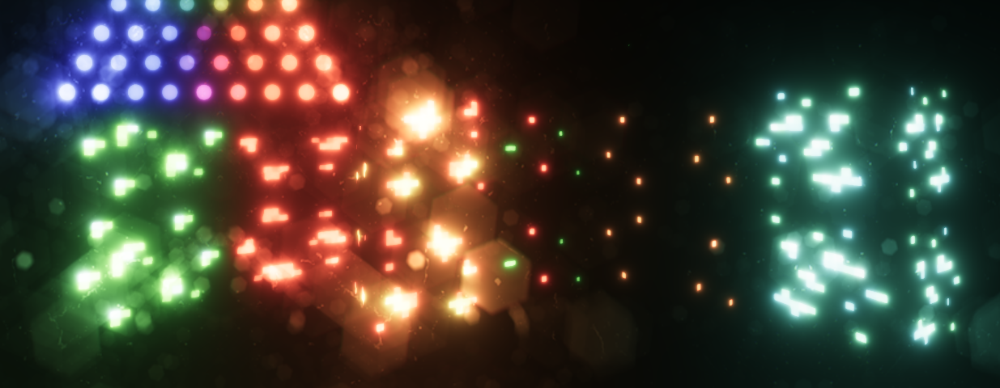   |  

| Without | Bloom + Reinhard Tone Mapping |  
|---|---|  
|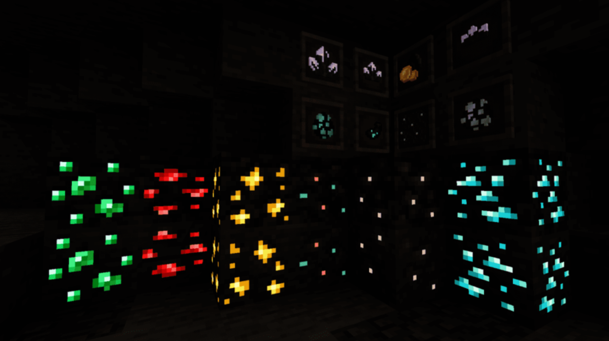 | 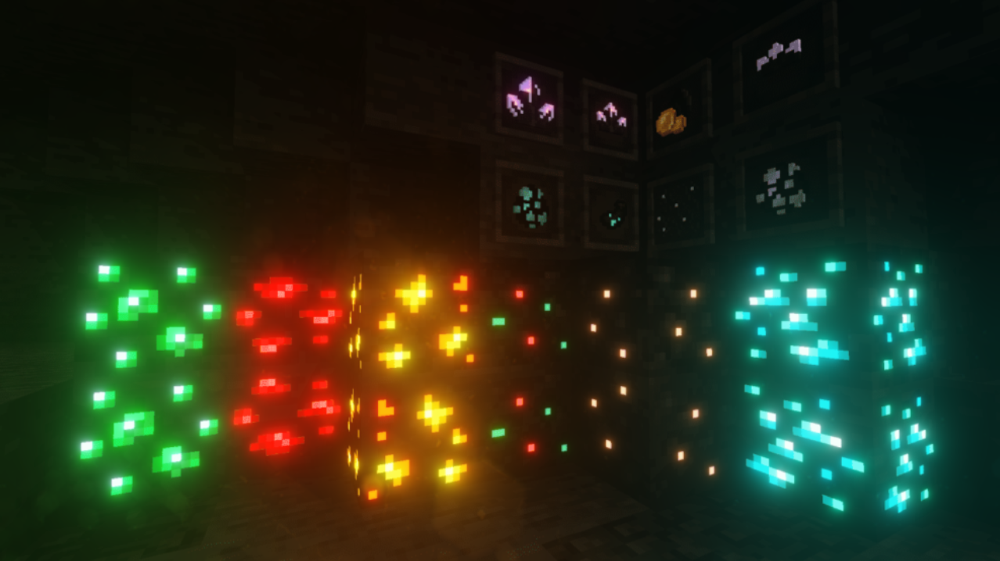   |  

```gml
FX_Bloom(enabled, iterations, threshold, knee, intensity, color, whiteAmount, dirtEnable, dirtTexture, dirtIntensity, dirtScale, dirtTiled, dirtCanDistort, antiFlicker, resolution, debug1, debug2);
```

| Name | Type | Description |  
|---|---|:---|  
| enabled | Bool | Defines whether the effect starts active or not. |  
| iterations | Real | Sets Bloom’s scattering, which is how far the effect reaches. Max: 16. recommended: 4 to 8. |  
| threshold | Real | Set the level of brightness to filter out pixels under this level. 0 above; 0 means full brightness. |  
| knee | Real | Controls the softness of the transition between the bloomed and non-bloomed areas of the image. |  
| intensity | Real | Set the strength of the Bloom filter. 0 to 5 recommended. There is not maximum amount. |  
| color | Color | The color that is multiplied by the bloom's final color. Default is c_white. |  
| whiteAmount | Real | How close to white Bloom will look, in very saturated colors. 1 is full white. |  
| dirtEnable | Bool | Defines whether to use dirt textures. |  
| dirtTexture | Pointer.Texture | The texture id used for the Dirt Lens. Use sprite_get_texture() or surface_get_texture(). |  
| dirtIntensity | Real | The intensity of Dirt Lens. 0 to 3 recommended. |  
| dirtScale | Real | The scale of Dirt Lens. 0.25 to 3 recommended. |  
| dirtTiled | Bool | Defines whether the dirt lens will repeat seamlessly. |  
| dirtCanDistort | Bool | If active, the dirt texture will distort according to the lens distortion effect. |  
| antiFlicker | Bool | If enabled, Bloom will improve pixel flickering. This affects performance (GPU). |  
| resolution | Real | Sets the resolution of the Bloom, this affects the performance. 1 is full resolution = more resources needed, but look better. 1 = full, 0.5 = falf. |  
| debug1 | Bool | Allows you to see the final bloom result alone. |  
| debug2 | Bool | Allows you to see exactly where the bloom is hitting the light parts. |  

</br>


## Sunshafts

Simulates the radial light scattering that arises when a very bright light source is partly obscured.  

| Without | With |  
|---|---|  
|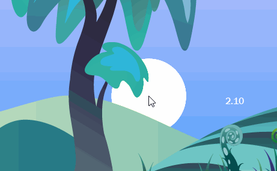 | 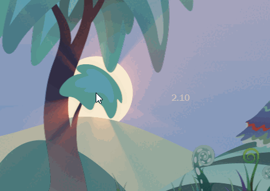   |  

```gml
FX_SunShafts(enabled, position, threshold, intensity, dimmer, scattering, raysNoiseEnable, raysIntensity, raysTiling, raysSpeed, raysOcclusionRadius, raysOcclusionSmoothness, raysNoiseTex, resolution, debugMode, sourceOffset);
```

| Name | Type | Description |
|---|---|:---|
| enabled | Bool | Defines whether the effect starts active or not. |
| position | Array\<Real\> | Sun position. An array with the normalized values (0 to 1), in this format: `[x, y]`. The value is in screen-space, so it depends on where you are going to draw post-processing. Example: normalized GUI coordinates. |
| threshold | Real | Set the level of brightness to filter out pixels under this level. 0 means full brightness. Values above 1 are HDR (which allows Sunshafts to glow without affecting the rest of the game's artwork, useful for sun effect). |
| intensity | Real | Set the strength of the Sunshafts effect. 0 to 5 recommended. |
| dimmer | Real | Maximum brightness level to be reduced. 0 to 5 recommended. |
| scattering | Real | How far the sun's rays are projected. 0 to 1. |
| raysNoiseEnable | Bool | Defines whether to use noise variations in the sun. |
| raysIntensity | Real | The intensity of noise rays. 0 to 1. |
| raysTiling | Real | Repetition of noise rays. 1 to 10 recommended. |
| raysSpeed | Real | The rays speed. 0 to 1 recommended. |
| raysOcclusionRadius | Real | Radius of the ray occlusion circle. |
| raysOcclusionSmoothness | Real | Smoothness of the ray occlusion circle. |
| raysNoiseTex | Pointer.Texture | The noise texture, used for rays. |
| resolution | Real | Sets the resolution of the sun shafts, this changes the performance. 1 = full, 0.5 = half. |
| debugMode | Bool | Allows you to see exactly where the sunshaft is hitting the light parts. |
| sourceOffset | Real | Source stack offset. Indicates which stack the effect will use as a source to emit lightning. The default is 0, which is the previous stack. Note: the shift happens to the previous stack always, no matter if the value is negative or positive. |

</br>


## Shockwaves

Shockwaves screen distortion effect, perfect for enhancing explosion simulation or related stuff. It's possible to customize chromatic aberration using a small 3x1 LUT texture. The distortion is sprite-based, so you can distort it however you want.

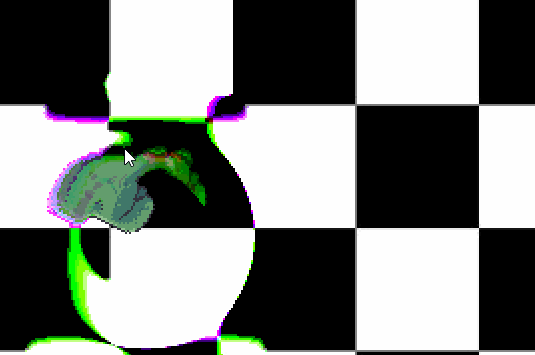

```gml
FX_Shockwaves(enabled, amount, aberration, prismaLutTexture, texture);
```

| Name | Type | Description |
|---|---|:---|
| enabled | Bool | Defines whether the effect starts active or not. |
| amount | Real | Displacement amount. 0 to 1. |
| aberration | Real | Chromatic aberration offset amount. 0 to 1. |
| prismaLutTexture | Pointer.Texture | The spectral LUT texture, used to define the spectral colors. Texture should be 8x3, with RGB channels horizontally. Use `sprite_get_texture()` or `surface_get_texture()`. |
| texture | Pointer.Texture | Normalmap surface. Use `shockwave_render()` to make it easy. |

</br>


## Chromatic Aberration

It mimics the color distortion that a real-world camera produces when its lens fails to join all colors to the same point.

| Example | Example |  
|---|---|  
|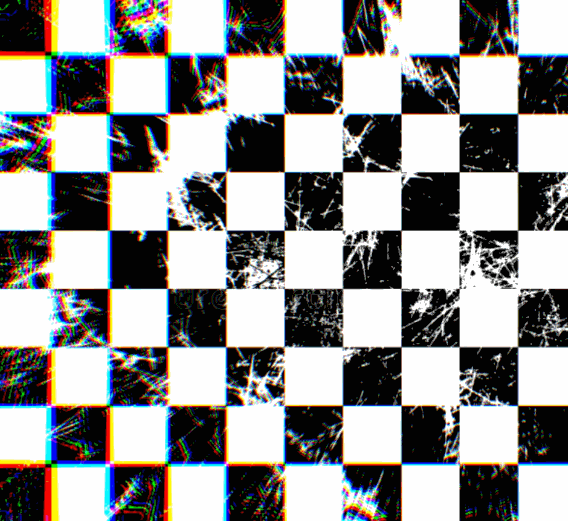 | 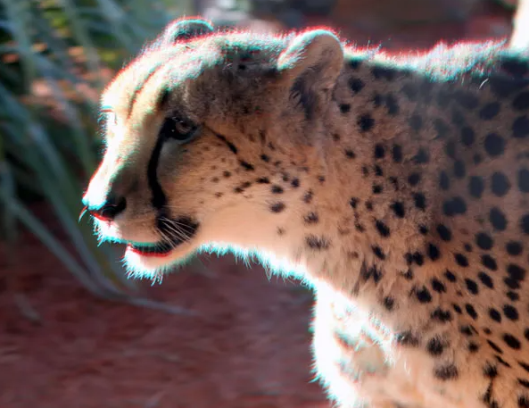   |  

```gml
FX_ChromaticAberration(enabled, intensity, angle, inner, centerRadius, blurEnable, prismaLUTtexture);
```

| Name | Type | Description |
|---|---|:---|
| enabled | Bool | Defines whether the effect starts active or not. |
| intensity | Real | How much the channels are distorted. 0 to 50 recommended. |
| angle | Real | The chromatic angle. Default is 35. |
| inner | Bool | Defines how much the chromatic will be applied only to the edges, or entirely. 0 to 1. Where 0 = no center distortion. |
| centerRadius | Real | How much the effect is blended with the center. 0 to 3 recommended. |
| blurEnable | Bool | Defines whether to blur the chromatic effect. |
| prismaLUTtexture | Pointer.Texture | The spectral LUT texture, used to define the spectral colors. Texture should be 8x3, with RGB channels horizontally. Use `sprite_get_texture()` or `surface_get_texture()`. |

</br>


## Depth Of Field

Also known as Bokeh. Is an effect that describes the extent to which objects that are more or less close to the plane of focus appear to be sharp. This effect is given by an optical phenomenon called circles of confusion, which progressively increase as objects move away from the plane of focus.

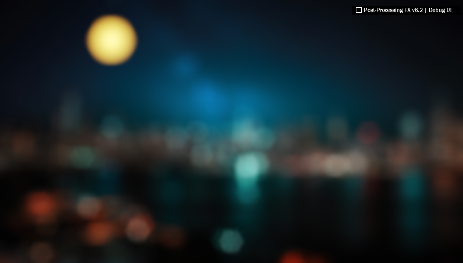

| 2D Scene | 3D Scene |  
|---|---|  
|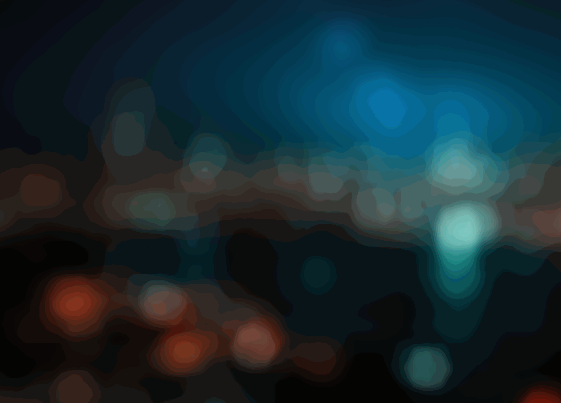 | 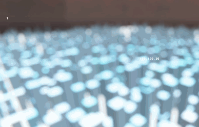   |  

```gml
FX_DepthOfField(enabled, radius, intensity, bladesAperture, bladesAngle, zDepthEnable, zDepthTexture, zDepthLinearize, zDepthNear, zDepthFar, focusDistance, focusRange, focusSmoothness, focusNear, focusFar, resolution, debugMode);
```

| Name | Type | Description |
|---|---|:---|
| enabled | Bool | Defines whether the effect starts active or not. |
| radius | Real | Focus radius. |
| intensity | Real | Bokeh bright intensity. |
| bladesAperture | Real | Sets shape's edge number. |
| bladesAngle | Real | Sets the shape angle, in degrees. |
| zDepthEnable | Bool | Defines if the DOF will use a depth map. |
| zDepthTexture | Pointer.Texture | Depth map (Z-Buffer) texture. If undefined, it will use the depth buffer of the post-processing input surface (e.g. `application_surface`). |
| zDepthLinearize | Real | If true, linearize the depth texture based on the zNear and zFar planes. |
| zDepthNear | Real | The near plane of the camera. Example: 1. |
| zDepthFar | Real | The far plane of the camera. Example: 16000. |
| focusDistance | Real | Set the distance from the Camera to the focus point. 0 to 1. |
| focusRange | Real | Set the range, between the Camera sensor and the Camera lens. The larger the value is, the shallower the depth of field. 0 to 1. |
| focusSmoothness | Real | The smoothness between the focus point and the focus range. |
| focusNear | Real | Defines how much the focus should reach the near plane. 0 to 1. |
| focusFar | Real | Defines how much the focus should reach the far plane. 0 to 1. |
| resolution | Real | Sets the resolution of the Depth of Field, this changes the performance. 1 = full, 0.5 = half. |
| debugMode | Bool | Allows you to see exactly where the Bokeh is blurring. Colors in cyan are where the blur hits. |

</br>


## Glitch

Super cool Glitch effect.

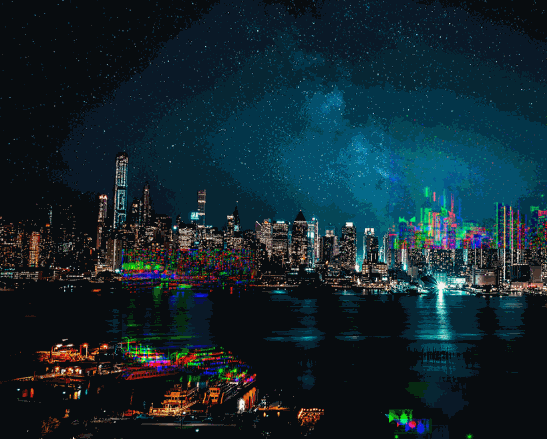

| Name | Type | Description |
|---|---|:---|
| enabled | Bool | Defines whether the effect starts active or not. |
| intensity | Real | The effect intensity. |

This effect is experimental.

</br>


## VHS

VHS (80s decade) effect simulation.


```gml
FX_VHS(enabled, chromaticAberration, scanAberration, grainIntensity, grainHeight, grainFade, grainAmount, grainSpeed, grainInterval, scanSpeed, scanSize, scanOffset, hScanOffset, flickeringIntensity, flickeringSpeed, wiggleAmplitude);
```

| Name | Type | Description |
|---|---|:---|
| enabled | Bool | Defines whether the effect starts active or not. |
| chromaticAberration | Real | Sets the amount of chromatic aberration to use. 0 to 10 recommended. |
| scanAberration | Real | Sets the amount of chromatic aberration to use on scan lines. 0 to 10 recommended. |
| grainIntensity | Real | Sets the amount of granular. 0 to 1. |
| grainHeight | Real | Sets the height of a granular bar. 1 to 100 recommended. Low values make the bar thinner. |
| grainFade | Real | Creates a gradient effect to smoothly fade the grain to the bottom. 0 to 1. |
| grainAmount | Real | Defines the number of repetitions of the grain bars. 1 to 100 recommended. |
| grainSpeed | Real | Defines the grain movement speed. 0 to 1 recommended. |
| grainInterval | Real | Allows smoothing between grain bar variation and more spread. 0 to 1. |
| scanSpeed | Real | Sets the speed at which scan glitch moves. 0 to 10 recommended. |
| scanSize | Real | Set scan glitch size. 0 to 1. |
| scanOffset | Real | Set scan glitch offset, which is how much it will move horizontally. 0 to 1. |
| hScanOffset | Real | Sets how much the horizontal fixed scan will change sporadically. 0 to 1. |
| flickeringIntensity | Real | Sets the intensity of the flickering/blinking effect. 0 to 1. |
| flickeringSpeed | Real | Sets the flickering animation speed. 0 to 10.0 recommended. |
| wiggleAmplitude | Real | Defines how much the image should shake vertically. 0 to 1. |

</br>


## Sharpen

The sharpening effect enhances image clarity and detail by increasing the contrast along edges and fine details.


```gml
FX_Sharpen(enabled, intensity, radius, limiar);
```

| Name | Type | Description |
|---|---|:---|
| enabled | Bool | Defines whether the effect starts active or not. |
| intensity | Real | Defines the sharpen intensity. 0 - 10 recommended. |
| radius | Real | Defines the sharpen radius around edges. 0 - 10 recommended. |
| limiar | Real | Defines the sharpen limiar blur (mip mapping is required). 0 - 8 recommended. |

</br>


## Long Exposure

Slow Motion effect, also known as "Long Exposure" in photography (or just Drunk vision).

| Total blur | Lights only | Lights only, HDR |  
|---|---|---|  
|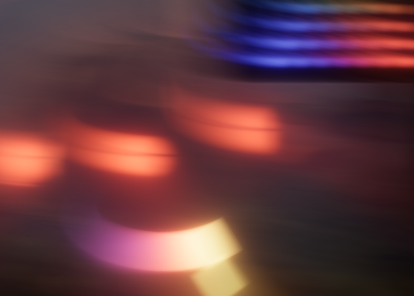 |  | 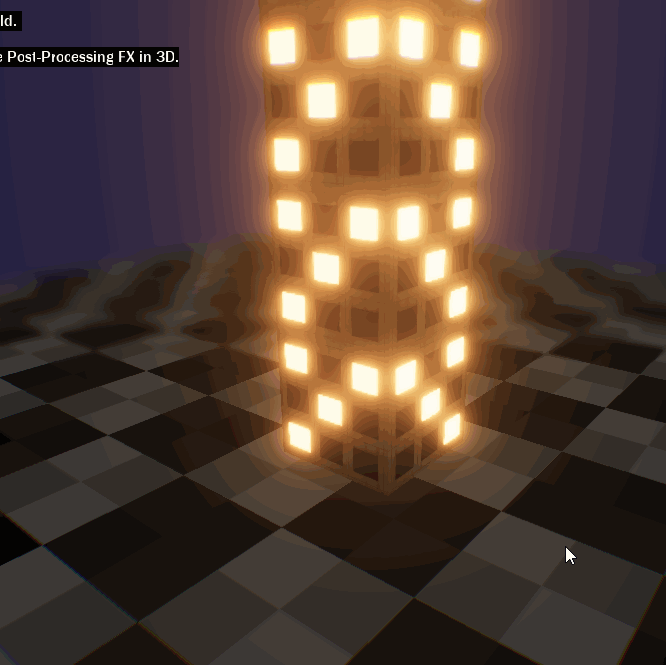   |  

```gml
FX_LongExposure(enabled, intensity, iterations, threshold, lightsIntensity, resolution, debugMode, sourceOffset);
```

| Name | Type | Description |
|---|---|:---|
| enabled | Bool | Defines whether the effect starts active or not. |
| intensity | Real | Sets the intensity level of the effect. 0 - 1. 0.85 recommended. |
| iterations | Real | Sets the strength of the slow motion. This also sets the exposure of the lights. 0 - 10 recommended. Above 0, a new surface will be created for each iteration, so be careful with memory. |
| threshold | Real | Set the level of brightness to filter out pixels under this level. 0 means full brightness. Values above 1 are HDR. |
| lightsIntensity | Real | Sets the intensity of the lights (when threshold is greater than zero). |
| resolution | Real | Sets the resolution of the trails, this affects the performance. 1 is full resolution = more resources needed, but looks better. 1 = full, 0.5 = half. |
| debugMode | Bool | Lets you see where the threshold reaches. |
| sourceOffset | Real | Source stack offset. Indicates which stack the slow motion effect will use as a source to emit lightning. The default is 0, which is the Slow Motion stack. Note: the shift happens to the previous stack always, no matter if the value is negative or positive. |

</br>


## Gaussian Blur

Blur with Gaussian distribution.

| Without | With |  
|---|---|  
|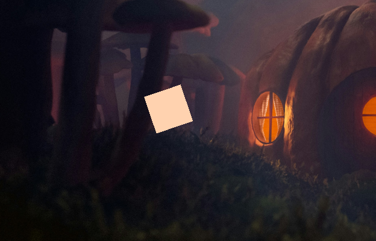 | 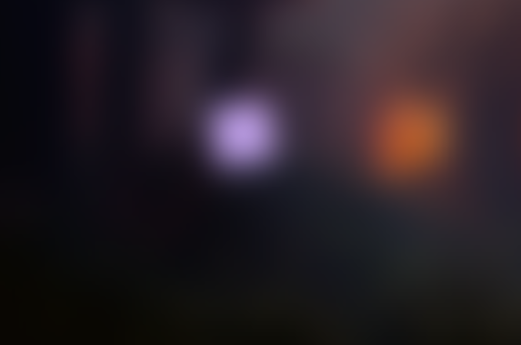   |  

```gml
FX_GaussianBlur(enabled, amount, maskPower, maskScale, maskSmoothness, resolution);
```

| Name | Type | Description |
|---|---|:---|
| enabled | Bool | Defines whether the effect starts active or not. |
| amount | Real | The amount to blur. 0 to 1. |
| maskPower | Real | Defines the radial center area of the mask, based on position. 0 to 15 recommended. |
| maskScale | Real | Defines the radial mask scale. 0 to 3 recommended. |
| maskSmoothness | Real | Defines the mask border smoothness. 0 to 1. |
| resolution | Real | How much to downscale the image. Higher numbers mean higher performance at the cost of sharpness. 1 = full, 0.5 = half. |

</br>


## Kawase Blur

Blur effect similar to Gaussian Blur, but with better performance on low-end devices.

| Without | With |  
|---|---|  
|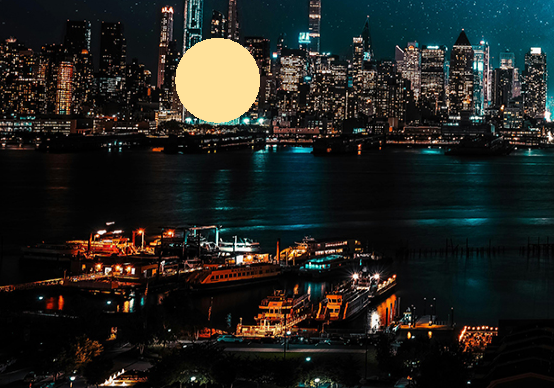 | 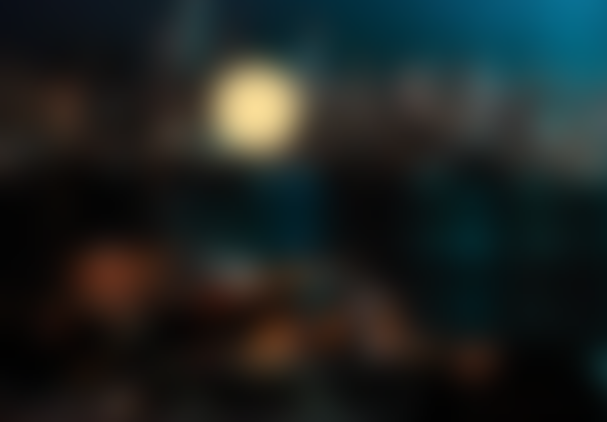   |  

```gml
FX_KawaseBlur(enabled, amount, iterations, maskpower, maskScale, maskSmoothness, resolution);
```

| Name | Type | Description |
|---|---|:---|
| enabled | Bool | Defines whether the effect starts active or not. |
| amount | Real | The amount to blur. This parameter is currently a multiplication with `iterations`. 0 to 1. |
| iterations | Real | The amount of blur passes. Larger numbers require more processing. 8 recommended. |
| maskpower | Real | Defines the radial center area of the mask, based on position. 0 to 15 recommended. |
| maskScale | Real | Defines the radial mask scale. 0 to 3 recommended. |
| maskSmoothness | Real | Defines the mask border smoothness. 0 to 1. |
| resolution | Real | How much to downscale the image. Higher numbers mean higher quality. 1 = full, 0.5 = half. |

</br>


## Motion Blur

Simulates a directional blur that occurs in an image when a real-world camera films objects moving faster than the camera’s exposure time.

| Without | With |  
|---|---|  
| | 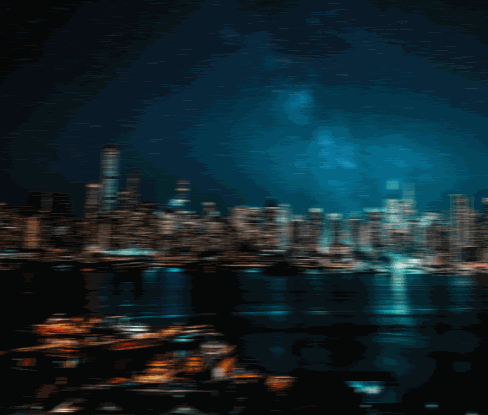   |  

```gml
FX_MotionBlur(enabled, radius, angle, center, maskPower, maskScale, maskSmoothness);
```

| Name | Type | Description |
|---|---|:---|
| enabled | Bool | Defines whether the effect starts active or not. |
| radius | Real | The amount of blur. 0 to 10 recommended. |
| angle | Real | The angle to create fast movement effect. |
| center | Array\<Real\> | Focus position. An array with the normalized values (0 to 1), in this format: `[x, y]`. |
| maskPower | Real | Defines the radial center area of the mask, based on position. 0 to 15 recommended. |
| maskScale | Real | Defines the radial mask scale. 0 to 3 recommended. |
| maskSmoothness | Real | Defines the mask border smoothness. 0 to 1. |

</br>


## Radial Blur

Blurred zoom effect to give the impression of speed.

| Without | With |  
|---|---|  
| | 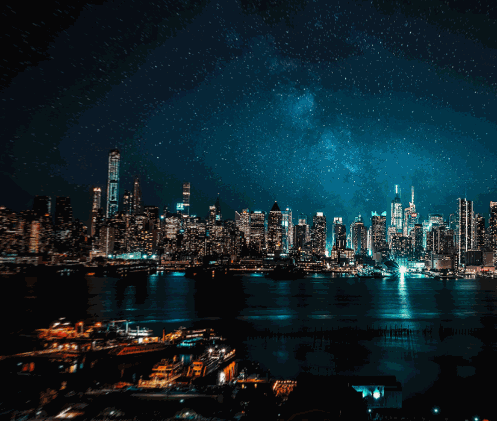   |  

```gml
FX_RadialBlur(enabled, radius, inner, center);
```

| Name | Type | Description |
|---|---|:---|
| enabled | Bool | Defines whether the effect starts active or not. |
| radius | Real | The amount of blur. 0 to 1 recommended. |
| inner | Real | How far the blur extends from the center. |
| center | Array\<Real\> | Focus position. An array with the normalized values (0 to 1), in this format: `[x, y]`. |

</br>


## Mist

A fog/mist effect to give a gloomy look, which can be used in forests, imitate fire, and among others.

| Without | With | Customization |  
|---|---|---|  
| | 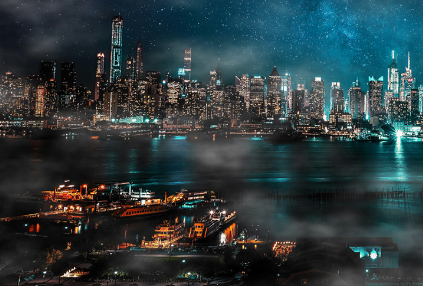 |    |  

```gml
FX_Mist(enabled, intensity, scale, tiling, speedd, angle, contrast, power, remap, color, mix, mixThreshold, noiseTex, offset, fadeAmount, fadeAngle);
```

| Name | Type | Description |
|---|---|:---|
| enabled | Bool | Defines whether the effect starts active or not. |
| intensity | Real | The mist intensity. 0 to 1 recommended. |
| scale | Real | Noise scale. 0 to 1. |
| tiling | Real | Repetition of noise rays. 0.25 to 10 recommended. |
| speedd | Real | Noise movement speed. |
| angle | Real | Noise angle. |
| contrast | Real | Noise contrast. |
| power | Real | Helps make noise sharper. 0 to 1 recommended. |
| remap | Real | Central softness. 0 to 0.99 recommended. |
| color | Real | Mist color tint. |
| mix | Real | Blending intensity with image lights. |
| mixThreshold | Real | The level of brightness to filter out pixels under this level. 0 to 1; 0 means all light pixels. |
| noiseTex | Pointer.Texture | The noise texture to be used as mist/fog. |
| offset | Array\<Real\> | Position offset. Use the camera position. An array with absolute values, in this format: `[cam_x, cam_y]`. |
| fadeAmount | Real | Partial fade amount. |
| fadeAngle | Real | Partial fade angle. |

</br>


## Vignette

Vignetting is the term for the darkening and/or desaturating towards the edges of an image compared to the center. You can use vignetting to draw focus to the center of an image.

| Without | With |  
|---|---|  
| | 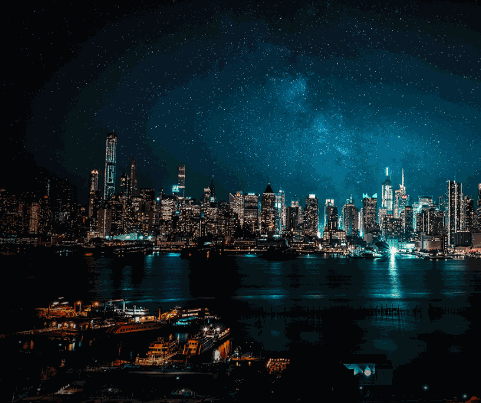   |  

```gml
FX_Vignette(enabled, intensity, curvature, inner, outer, color, center, rounded, linear);
```

| Name | Type | Description |
|---|---|:---|
| enabled | Bool | Defines whether the effect starts active or not. |
| intensity | Real | Vignette alpha/transparency. |
| curvature | Real | Vignette roundness. |
| inner | Real | The inside area of Vignette. From 0 to 2. |
| outer | Real | The outside area of Vignette. From 0 to 2. |
| color | Real | Vignette color. |
| center | Array\<Real\> | The position. An array with the normalized values (0 to 1), in this format: `[x, y]`. |
| rounded | Bool | Defines that the Vignette will be a perfect circle. |
| linear | Bool | Use a linear curve or not. |

</br>


## Tone Mapping

Compress the dynamic range of an image to make it more suitable for display on devices with limited dynamic range (HDR to LDR). It is also used for aesthetic purposes.

This effect is useful when using HDR lighting, including Bloom and Sunshafts. This is useful for preventing the colors from being overexposed. Linear is the same as not using the effect, i.e., pure HDR colors. This effect will attempt to reduce the range for LDR, and this can cause the colors to appear somewhat faded, so it may be necessary to adjust the contrast and saturation afterward.

| Linear (None) | Reinhard | ACES | ACES Filmic |  
|---|---|---|---|  
|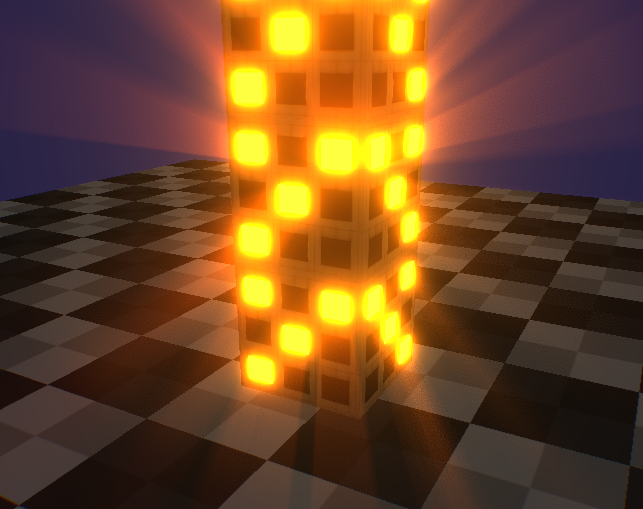 | 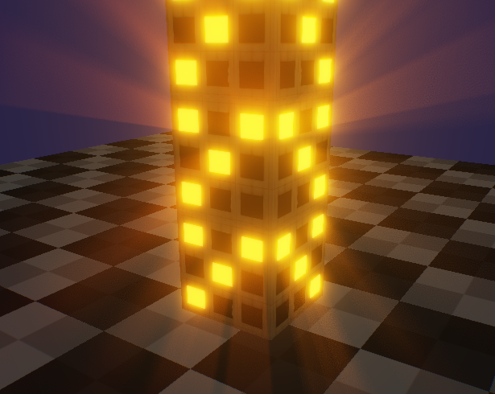 | 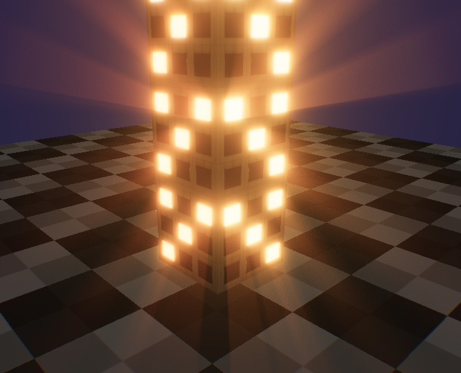 | 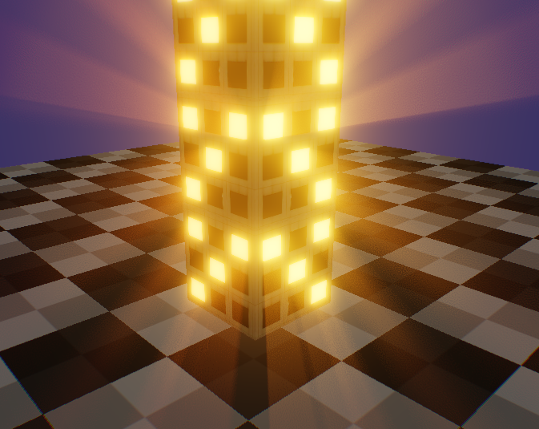   |  

```gml
FX_ToneMapping(enabled, mode, white);
```

| Name | Type | Description |
|---|---|:---|
| enabled | Bool | Defines whether the effect starts active or not. |
| mode | Real | Tone Mapping mode. 0 = Linear \| 1 = Reinhard \| 2 = ACES \| 3 = ACES Film. |
| white | Real | The white amount. 0 = No additional white. 1 = Same as Linear tone mapping. More than 1 = more white. |

</br>


## LUT

Uses a LUT texture to apply color correction (useful for Mobile as it's lightweight).

| Without | With | Customization | Texture  
|---|---|---|---|  
|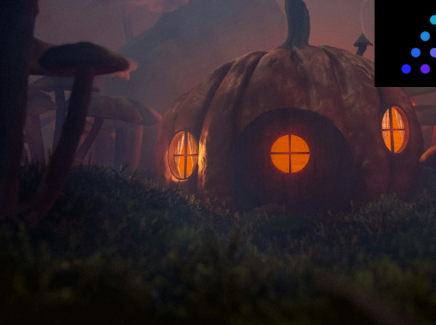 | 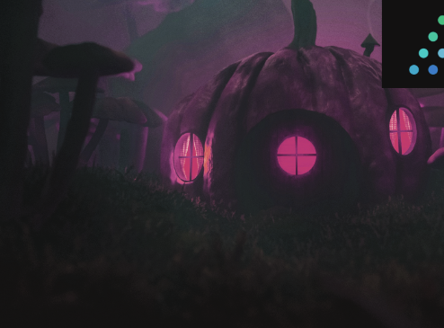 | 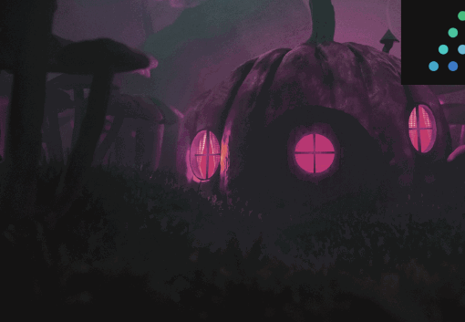 | 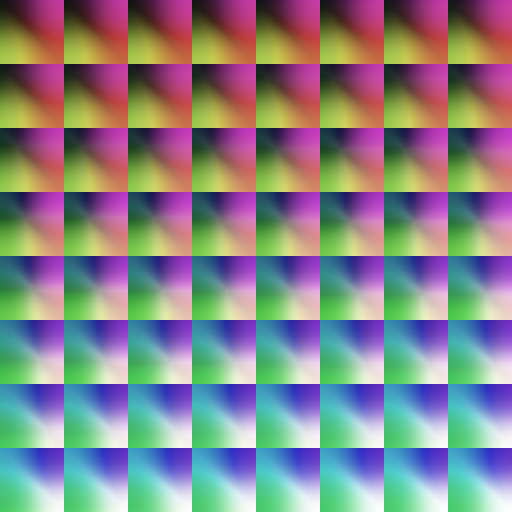  |  

```gml
FX_LUT(enabled, intensity, type, horizontalSquares, texture);
```

| Name | Type | Description |
|---|---|:---|
| enabled | Bool | Defines whether the effect starts active or not. |
| intensity | Real | How much the LUT-modified image merges with the original image. 0 - 1. |
| type | Real | The LUT type to be used. 0: Strip \| 1: Grid \| 2: Hald Grid (Cube). |
| horizontalSquares | Real | Horizontal LUT squares. Example: 16 (Strip), 8 (Grid), 8 (Hald Grid). |
| texture | Pointer.Texture | The LUT texture. Use `sprite_get_texture()` or `surface_get_texture()`. |

</br>


## Color Curves

Color grading curves provide an advanced method for fine-tuning specific ranges of hue, saturation or luminosity in an image. You can manipulate the curves using graphs to accomplish effects like saturation in certain colors.

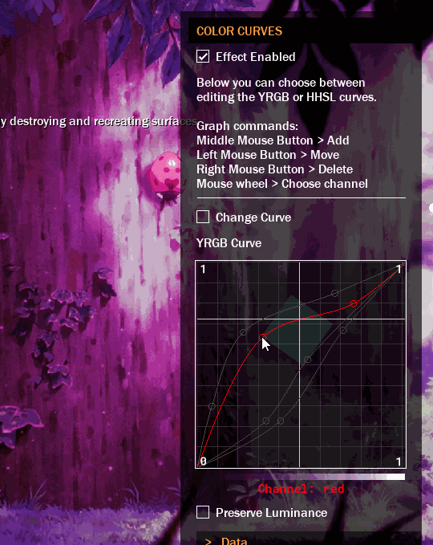

```gml
FX_ColorCurves(enabled, intensity, preserveLuminance, yrgbCurve, hhslCurve);
```

| Name | Type | Description |
|---|---|:---|
| enabled | Bool | Defines whether the effect starts active or not. |
| intensity | Real | How much the modified image merges with the original image. 0 - 1. |
| preserveLuminance | Real | Sets whether curves should preserve luminance. |
| yrgbCurve | Struct | A curve generated with `PPFX_Curve()`. |
| hhslCurve | Struct | A curve generated with `PPFX_Curve()`. |

</br>


## Palette Swap

Replace all colors in the image with colors from a palette, based on luminosity. The palette must be horizontal. The pixels start to be read from left to right (use the Flip parameter to invert the luminance).

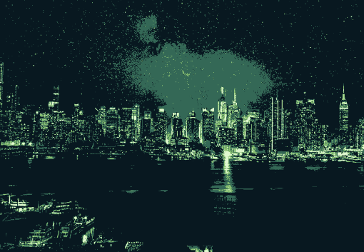

```gml
FX_PaletteSwap(enabled, row, flip, texture, paletteHeight, threshold, smoothness, limitColors);
```

| Name | Type | Description |
|---|---|:---|
| enabled | Bool | Defines whether the effect starts active or not. |
| row | Real | Vertical position on palette sprite, to use pixels in sequence. Default is 0 or 1. |
| flip | Bool | Sets whether to invert luminosity. Default is `false`. |
| texture | Pointer.Texture | The palette LUT texture. Use `sprite_get_texture()` or `surface_get_texture()`. |
| paletteHeight | Real | Palette sprite height (in pixels). A 3x1 palette sprite has 1 pixel height, for example. |
| threshold | Real | Set the level of brightness to filter out pixels under this level. 0 to 1. 0 means all light pixels (default). |
| smoothness | Real | How much smoothness to apply to the threshold. 0 to 1. |
| limitColors | Bool | Defines whether you want to limit the number of colors in the image to the number of colors in the palette. |

</br>


## Exposure

Adjusts the overall exposure of the screen.


```gml
FX_Exposure(enabled, value);
```

| Name | Type | Description |
|---|---|:---|
| enabled | Bool | Defines whether the effect starts active or not. |
| value | Real | Exposure amount. 0 to 2 recommended. |

</br>


## Contrast

The overall range of tonal values.

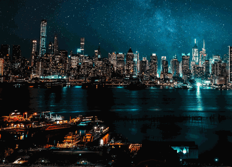

```gml
FX_Contrast(enabled, value);
```

| Name | Type | Description |
|---|---|:---|
| enabled | Bool | Defines whether the effect starts active or not. |
| value | Real | The contrast amount. 0 to 2 recommended. |

</br>


## Brightness

The amount of white color mixed with the image.


```gml
FX_Brightness(enabled, value);
```

| Name | Type | Description |
|---|---|:---|
| enabled | Bool | Defines whether the effect starts active or not. |
| value | Real | The amount of brightness. 0 to 2 recommended. |

</br>


## Saturation

Describes the intensity of the color. You can use it for grayscale.


```gml
FX_Saturation(enabled, value);
```

| Name | Type | Description |
|---|---|:---|
| enabled | Bool | Defines whether the effect starts active or not. |
| value | Real | How much the grayscale is blended with the original image. 0 to 5 recommended. |

</br>


## Hue Shift

Change the overall color tone of an image.

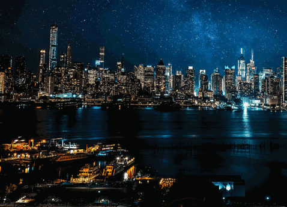

```gml
FX_HueShift(enabled, hue, saturation, preserveLuminance);
```

| Name | Type | Description |
|---|---|:---|
| enabled | Bool | Defines whether the effect starts active or not. |
| hue | Real | The hue, in degrees. 0 to 255. Tip: you can use `color_get_hue(color)` here. |
| saturation | Real | The saturation. 0 to 1. |
| preserveLuminance | Real | Sets whether curves should preserve luminance. |

</br>


## Colorize

Colorize image preserving white colors.

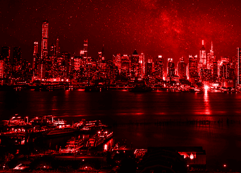

```gml
FX_ColorTint(enabled, color, intensity);
```

| Name | Type | Description |
|---|---|:---|
| enabled | Bool | Defines whether the effect starts active or not. |
| color | Real | The color. Example: `c_white` \| `make_color_rgb()` \| `make_color_hsv()`. |
| intensity | Real | How much to blend the colored image with the original image. 0 to 1. |

</br>


## Color Tint

Multiply the image by a color.

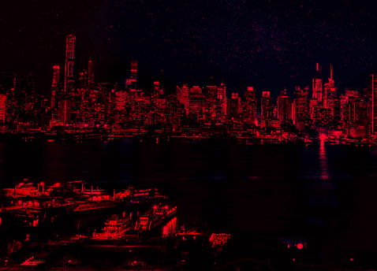

| Name | Type | Description |
|---|---|:---|
| enabled | Bool | Defines whether the effect starts active or not. |
| color | Real | The color. Example: `c_white` \| `make_color_rgb()` \| `make_color_hsv()`. |
| intensity | Real | How much to blend the colored image with the original image. 0 to 1. |

</br>


## Invert Colors

Invert all colors, such that white becomes black and vice versa.

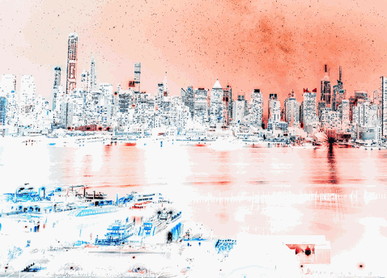

```gml
FX_InvertColors(enabled, intensity);
```

| Name | Type | Description |
|---|---|:---|
| enabled | Bool | Defines whether the effect starts active or not. |
| intensity | Real | How much the inverted image merges with the original image. 0 to 1. |

</br>


## Channels Mixer

Channel Mixer allows you to take the red, green, and blue channels and boost or pull back the levels of each one.


```gml
FX_ChannelMixer(enabled, redRed, redGreen, redBlue, greenRed, greenGreen, greenBlue, blueRed, blueGreen, blueBlue);
```

| Name | Type | Description |
|---|---|:---|
| enabled | Bool | Defines whether the effect starts active or not. |
| redRed | Real | The red color of the red channel. 0 - 2 recommended. Default is 1. |
| redGreen | Real | The green color of the red channel. 0 - 2 recommended. Default is 0. |
| redBlue | Real | The blue color of the red channel. 0 - 2 recommended. Default is 0. |
| greenRed | Real | The red color of the green channel. 0 - 2 recommended. Default is 0. |
| greenGreen | Real | The green color of the green channel. 0 - 2 recommended. Default is 1. |
| greenBlue | Real | The blue color of the green channel. 0 - 2 recommended. Default is 0. |
| blueRed | Real | The red color of the blue channel. 0 - 2 recommended. Default is 0. |
| blueGreen | Real | The green color of the blue channel. 0 - 2 recommended. Default is 0. |
| blueBlue | Real | The blue color of the blue channel. 0 - 2 recommended. Default is 1. |

</br>


## Shadow Midtone Highlight (Color Balance)

This effect separately controls the shadows, midtones, and highlights of the image.


```gml
FX_ShadowMidtoneHighlight(enabled, shadowRed, shadowGreen, shadowBlue, midtoneRed, midtoneGreen, midtoneBlue, highlightRed, highlightGreen, highlightBlue, shadowRangeMin, shadowRangeMax, highlightRangeMin, highlightRangeMax);
```

| Name | Type | Description |
|---|---|:---|
| enabled | Bool | Defines whether the effect starts active or not. |
| shadowRed | Real | The red color of shadows. 0 - 2 recommended. Default is 1. |
| shadowGreen | Real | The green color of shadows. 0 - 2 recommended. Default is 0. |
| shadowBlue | Real | The blue color of shadows. 0 - 2 recommended. Default is 0. |
| midtoneRed | Real | The red color of midtones. 0 - 2 recommended. Default is 0. |
| midtoneGreen | Real | The green color of midtones. 0 - 2 recommended. Default is 1. |
| midtoneBlue | Real | The blue color of midtones. 0 - 2 recommended. Default is 0. |
| highlightRed | Real | The red color of highlights. 0 - 2 recommended. Default is 0. |
| highlightGreen | Real | The green color of highlights. 0 - 2 recommended. Default is 0. |
| highlightBlue | Real | The blue color of highlights. 0 - 2 recommended. Default is 1. |
| shadowRangeMin | Real | The shadow range minimum value. 0 - 1. |
| shadowRangeMax | Real | The shadow range maximum value. 0 - 1. |
| highlightRangeMin | Real | The highlight range minimum value. 0 - 1. |
| highlightRangeMax | Real | The highlight range maximum value. 0 - 1. |

</br>


## Lift Gamma Gain

This effect allows you to perform three-way color grading.


| Name | Type | Description |
|---|---|:---|
| enabled | Bool | Defines whether the effect starts active or not. |
| liftIntensity | Real | Defines the lift intensity. |
| gammaIntensity | Real | Defines the gamma intensity. |
| gainIntensity | Real | Defines the gain intensity. |
| liftRed | Real | Defines the lift red channel intensity. |
| liftGreen | Real | Defines the lift green channel intensity. |
| liftBlue | Real | Defines the lift blue channel intensity. |
| gammaRed | Real | Defines the gamma red channel intensity. |
| gammaGreen | Real | Defines the gamma green channel intensity. |
| gammaBlue | Real | Defines the gamma blue channel intensity. |
| gainRed | Real | Defines the gain red channel intensity. |
| gainGreen | Real | Defines the gain green channel intensity. |
| gainBlue | Real | Defines the gain blue channel intensity. |

</br>


## Channels

Sets color levels per RGB channel.


```gml
FX_Channels(enabled, red, green, blue);
```

| Name | Type | Description |
|---|---|:---|
| enabled | Bool | Defines whether the effect starts active or not. |
| red | Real | The red amount. 0 to 1. |
| green | Real | The green amount. 0 to 1. |
| blue | Real | The blue amount. 0 to 1. |

</br>


## White Balance

White balance is used to adjust color temperature to match the color of the light source so that white objects appear white.

| Example | Temperature and Tint |  
|---|---|  
| | 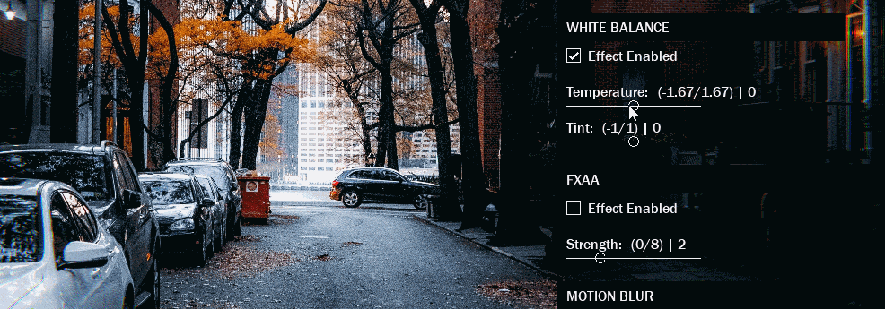   |  

```gml
FX_WhiteBalance(enabled, temperature, tint);
```

| Name | Type | Description |
|---|---|:---|
| enabled | Bool | Defines whether the effect starts active or not. |
| temperature | Real | Higher values result in a warmer color temperature and lower values result in a colder color temperature. -1 to 1. |
| tint | Real | Compensate for a green or magenta tint. -1 to 1. |

</br>


## Posterization

Defines the amount of color displayed on the screen.

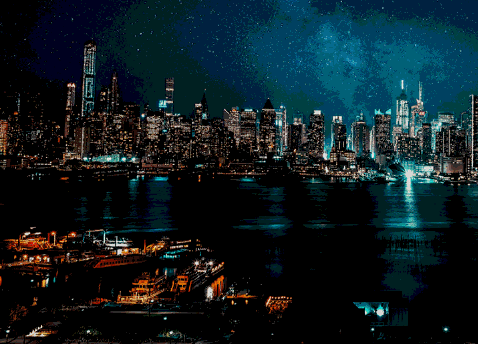

```gml
FX_Posterization(enabled, colorFactor);
```

| Name | Type | Description |
|---|---|:---|
| enabled | Bool | Defines whether the effect starts active or not. |
| colorFactor | Real | The amount of colors. 2 to 256 recommended. |

</br>


## Lens Distortion

This effect simulates CRT distortion, where the distortion can be positive (Barrel) or negative (Pincushion). You can hide border artifacts with another effect called "Border".

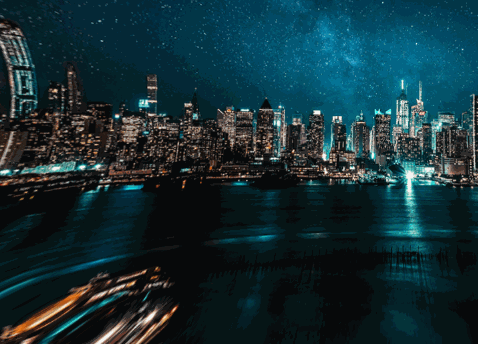

```gml
FX_LensDistortion(enabled, amount);
```

| Name | Type | Description |
|---|---|:---|
| enabled | Bool | Defines whether the effect starts active or not. |
| amount | Real | Distortion amount. Positive = Barrel, Negative = Pincushion. 0 = No distortion. Recommended: -1 to 1. |

</br>


## Displace Maps

Distort screen using a texture, perfect for simulating rain, underwater, water drops/drops on the screen and related things.


```gml
FX_DisplaceMap(enabled, amount, scale, speed, angle, texture, offset);
```

| Name | Type | Description |
|---|---|:---|
| enabled | Bool | Defines whether the effect starts active or not. |
| amount | Real | Displacement amount. 0 to 1. |
| scale | Real | The scale amount. Default is 1 (no scale). 0.25 to 20 recommended. |
| speed | Real | Movement speed. |
| angle | Real | Movement direction. |
| texture | Pointer.Texture | Normal map texture with distortion information. |
| offset | Array\<Real\> | Position offset. Use the camera position. An array with absolute values, in this format: `[cam_x, cam_y]`. |

</br>


## Panorama

Creates a side warp effect to simulate perspective.

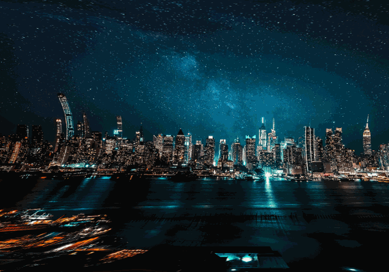

```gml
FX_Panorama(enabled, depthX, depthY);
```

| Name | Type | Description |
|---|---|:---|
| enabled | Bool | Defines whether the effect starts active or not. |
| depthX | Real | The horizontal distortion depth. 0 to 3. |
| depthY | Real | The vertical distortion depth. 0 to 3. |

</br>


## Pixelize

Turn small pixels into artificial big pixels.

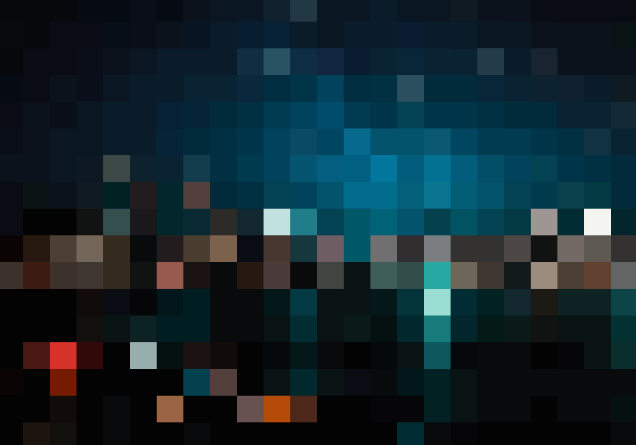

```gml
FX_Pixelize(enabled, amount, pixelMaxSize, steps);
```

| Name | Type | Description |
|---|---|:---|
| enabled | Bool | Defines whether the effect starts active or not. |
| amount | Real | Overall pixel resolution multiplier. 0 to 1. |
| pixelMaxSize | Real | Maximum individual pixel size. |
| steps | Real | Steps to change pixelation intensity. Helps prevent sudden change. |

</br>


## Rotation

This effect rotates the screen, maintaining aspect ratio.

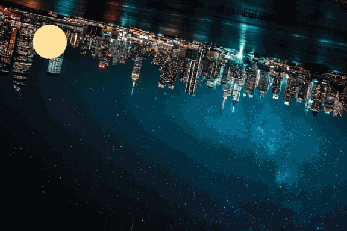

```gml
FX_Rotation(enabled, angle);
```

| Name | Type | Description |
|---|---|:---|
| enabled | Bool | Defines whether the effect starts active or not. |
| angle | Real | Rotation angle in degrees. |

</br>


## Zoom

This effect zooms (enlarges the image), following the normalized center position.

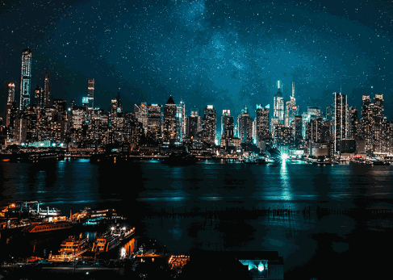

```gml
FX_Zoom(enabled, amount, range, center);
```

| Name | Type | Description |
|---|---|:---|
| enabled | Bool | Defines whether the effect starts active or not. |
| amount | Real | Zoom amount: 1 to 2. |
| range | Real | Zoom range. Example: 1 or 10. |
| center | Array\<Real\> | Zoom focus position. An array with the normalized values (0 to 1), in this format: `[x, y]`. |

</br>


## Sine Wave

Create a sine wave effect on the screen, using frequency and amplitude.


```gml
FX_SineWave(enabled, speedd, amplitude, frequency, offset);
```

| Name | Type | Description |
|---|---|:---|
| enabled | Bool | Defines whether the effect starts active or not. |
| speedd | Real | Animation speed. |
| amplitude | Array\<Real\> | Sine wave amplitude. |
| frequency | Array\<Real\> | Sine wave frequency. |
| offset | Array\<Real\> | Position offset. Use the camera position. An array with absolute values, in this format: `[cam_x, cam_y]`. |

</br>


## Shake

This effect causes the screen to shake.


```gml
FX_Shake(enabled, speed, magnitude, hSpeed, vSpeed);
```

| Name | Type | Description |
|---|---|:---|
| enabled | Bool | Defines whether the effect starts active or not. |
| speed | Real | Shake speed. A value from 0 to +inf. |
| magnitude | Real | Sets how far the screen will flicker; higher values means more shaking. Try values from 0 to 1. |
| hSpeed | Real | Horizontal shake speed. |
| vSpeed | Real | Vertical shake speed. |

</br>


## Swirl

Creates a swirl effect (like a Black Hole) at the defined position.

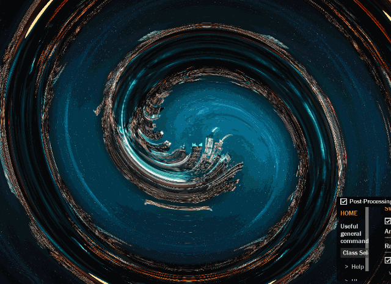

```gml
FX_Swirl(enabled, angle, radius, rounded, center);
```

| Name | Type | Description |
|---|---|:---|
| enabled | Bool | Defines whether the effect starts active or not. |
| angle | Real | Swirl angle. In degrees, 0 to 360. |
| radius | Real | Swirl radius. 0 to 1. |
| rounded | Real | If true, the swirl will be rounded (follow the aspect ratio). |
| center | Array\<Real\> | The position. An array with the normalized values (0 to 1), in this format: `[x, y]`. |

</br>


## Interference

Create interference effects to simulate broadcast glitches like old TV or cyber futuristic.


```gml
FX_Interference(enabled, intensity, speedd, block_size, interval, peakAmplitude1, peakAmplitude2);
```

| Name | Type | Description |
|---|---|:---|
| enabled | Bool | Defines whether the effect starts active or not. |
| intensity | Real | Displace amount. |
| speedd | Real | Interference animation speed. |
| block_size | Real | Vertical bars size. |
| interval | Real | Interval to start failure. Closer to 1 means rarer. |
| peakAmplitude1 | Real | Distortion when reaching the interval. |
| peakAmplitude2 | Real | Distortion out of interval. |

</br>


## Cinema Bars

Creates vertical and horizontal bars for artistic cinematic effects.


```gml
FX_CinemaBars(enabled, amount, intensity, smoothness, color, verticalEnable, horizontalEnable, canDistort);
```

| Name | Type | Description |
|---|---|:---|
| enabled | Bool | Defines whether the effect starts active or not. |
| amount | Real | Bars level. 0 to 1. |
| intensity | Real | Bars alpha. 0 to 1. |
| smoothness | Real | Edge smoothness. 0 to 1. 0.002 is good for anti-aliasing. |
| color | Real | Bars color. Example: `c_black`. |
| verticalEnable | Bool | Enable vertical bars. |
| horizontalEnable | Bool | Enable horizontal bars. |
| canDistort | Bool | If active, the bars will distort according to the lens distortion effect. |

</br>


## Dithering

Dithering removes color banding artifacts in gradients, usually seen in sky boxes due to color quantization. It is also used for aesthetic purposes.

| Without | Traditional | Custom 1 | Custom 2 | Luminance-based |  
|---|---|---|---|---|  
|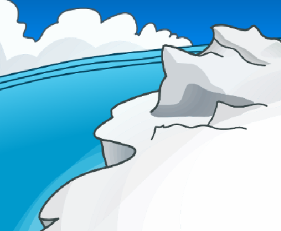 | 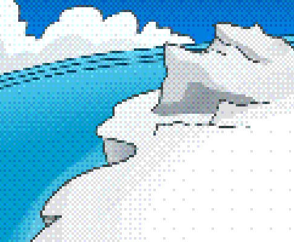 | 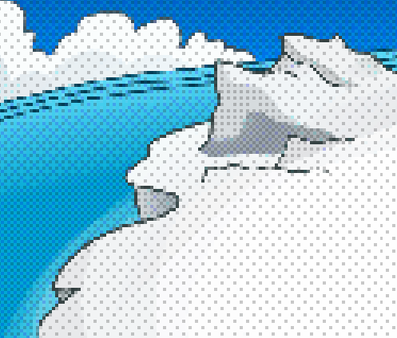 | 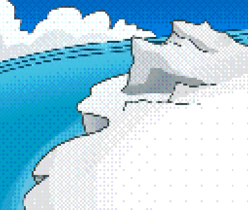 | 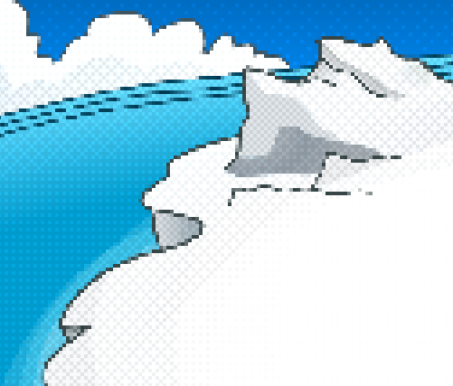   |  

```gml
FX_Dithering(enabled, mode, intensity, bit_levels, contrast, threshold, scale, bayerTexture, bayerSize);
```

| Name | Type | Description |
|---|---|:---|
| enabled | Bool | Defines whether the effect starts active or not. |
| mode | Real | Dithering technique to be used. 0 = Traditional \| 1 = Custom \| 2 = Custom \| 3 = Luminance based. |
| intensity | Real | How intense the dithering effect is applied. |
| bit_levels | Real | The color bit levels. |
| contrast | Real | The dithering contrast (not available in mode 0). Default is 1. |
| threshold | Real | Set the level of brightness to filter out pixels under this level. 0 to 1; 0 means all light pixels. |
| scale | Real | Pixel scale to compensate viewport size. |
| bayerTexture | Pointer.Texture | *(Optional)* Bayer texture to be used by dithering. This is a small square texture. |
| bayerSize | Real | Dithering square texture sprite side size. |

</br>


## Noise Grain

Simulates the random optical texture of photographic film, usually caused by small particles being present on the physical film.


```gml
FX_NoiseGrain(enabled, intensity, luminosity, scale, speed, mix, noiseTexture, noiseSize);
```

| Name | Type | Description |
|---|---|:---|
| enabled | Bool | Defines whether the effect starts active or not. |
| intensity | Real | Noise grain texture alpha. 0 to 1. |
| luminosity | Real | The brightness level of the noise. 0 to 1. |
| scale | Real | Noise scale. 0 to 1 recommended. |
| speed | Bool | Define the Noise Grain speed. |
| mix | Bool | Defines the noise mixing. 1 = full mix. |
| noiseTexture | Pointer.Texture | Noise texture. Use `sprite_get_texture()` or `surface_get_texture()`. |
| noiseSize | Real | Noise texture size. The size is used for both width and height. Example: 256 (pixels). |

</br>


## Scan Lines

Draw horizontal lines over the screen. It helps to simulate the effects of old CRT TVs.


```gml
FX_ScanLines(enabled, intensity, sharpness, speedd, amount, color, maskPower, maskScale, maskSmoothness);
```

| Name | Type | Description |
|---|---|:---|
| enabled | Bool | Defines whether the effect starts active or not. |
| intensity | Real | Lines alpha. 0 to 1. |
| sharpness | Real | Lines sharpness. 0 to 1. |
| speedd | Real | Lines vertical movement speed. 0 to 5 recommended. |
| amount | Real | Lines amount. 0 to 1. |
| color | Real | Lines color tint. Example: `c_black`. |
| maskPower | Real | Defines the radial center area of the mask, based on position. 0 to 15 recommended. |
| maskScale | Real | Defines the radial mask scale. 0 to 3 recommended. |
| maskSmoothness | Real | Defines the mask border smoothness. 0 to 1. |

</br>


## Speed Lines

Anime-like speedlines effect. Useful for demonstrating amazement in visual novels or speed in racing games, among others.


```gml
FX_SpeedLines(enabled, scale, tiling, speedd, rotSpeed, contrast, power, remap, color, maskPower, maskScale, maskSmoothness, noiseTexture);
```

| Name | Type | Description |
|---|---|:---|
| enabled | Bool | Defines whether the effect starts active or not. |
| scale | Real | Noise scale. Values close to 0 make lines more stretched. 0 to 20 recommended. |
| tiling | Real | Repetition of noise rays. 1 to 16 recommended. |
| speedd | Real | Lines movement speed. |
| rotSpeed | Real | Rotation speed. |
| contrast | Real | Lines contrast. |
| power | Real | Helps make lines sharper. 0 to 1 recommended. |
| remap | Real | Central softness. 0 to 0.99 recommended. |
| color | Real | The speedlines color tint. |
| maskPower | Real | Defines the radial center area of the mask, based on position. 0 to 15 recommended. |
| maskScale | Real | Defines the radial mask scale. 0 to 3 recommended. |
| maskSmoothness | Real | Defines the mask border smoothness. 0 to 1. |
| noiseTexture | Pointer.Texture | The noise texture to be used by the effect. |

</br>


## Fade

Simple fade to color effect (color overlay).

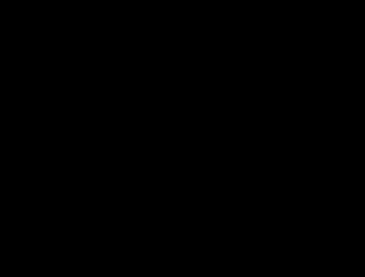

```gml
FX_Fade(enabled, amount, color);
```

| Name | Type | Description |
|---|---|:---|
| enabled | Bool | Defines whether the effect starts active or not. |
| amount | Real | Fade amount. 1 is full blended. |
| color | Real | The fade color. |

</br>


## NES Fade

Simulation of the NES transition.

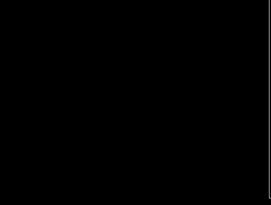

```gml
FX_NESFade(enabled, amount, levels);
```

| Name | Type | Description |
|---|---|:---|
| enabled | Bool | Defines whether the effect starts active or not. |
| amount | Real | Fade amount. 1 is full dark. |
| levels | Real | Number of colors to be used (posterization). |

</br>


## Border

Creates an edge gradient effect at the corners of the screen. Intended to be used when using Lens Distortion effect, to hide non-UV artifacts.

| Customization | Useful for TV filter |  
|---|---|  
|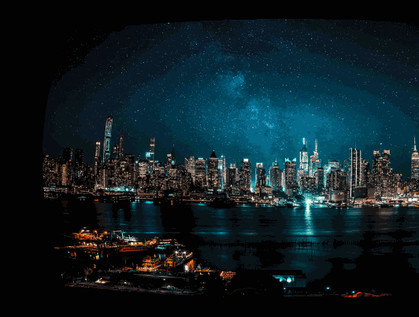 | 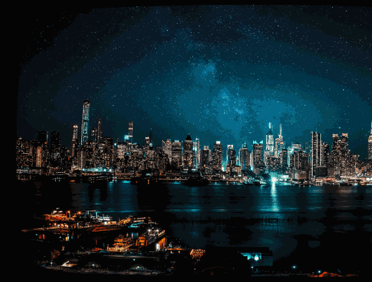   |  

```gml
FX_Border(enabled, curvature, smooth, color);
```

| Name | Type | Description |
|---|---|:---|
| enabled | Bool | Defines whether the effect starts active or not. |
| curvature | Real | The border curvature. 0 to 1 recommended. |
| smooth | Real | Border smoothness. 0 to 1 recommended. |
| color | Real | The border color. Example: `c_black`. |

</br>


## Compare (DEBUG)

With this function, it is possible to compare one stack with another. The default is to compare the last stack with the selected stack (stack index), but it is possible to change the stack order with .SetOrder().

```gml
FX_Compare(enabled, sideBySide, offset, stackIndex);
```

| Name | Type | Description |
|---|---|:---|
| enabled | Bool | Defines whether the effect starts active or not. |
| sideBySide | Bool | Lets you show the same images side by side. |
| offset | Real | Defines the comparison's x position. Value from 0 to 1. |
| stackIndex | Real | The stack index to compare. From 0 to the current stack. |

</br>


## FXAA

Fast Approximate Anti-Aliasing is a screen-space anti-aliasing algorithm to remove sharp edges.

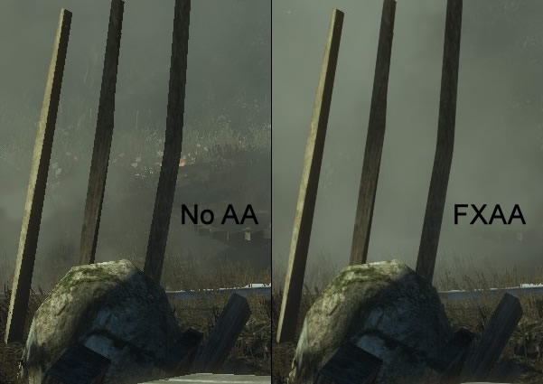

```gml
FX_FXAA(enabled, strength);
```

| Name | Type | Description |
|---|---|:---|
| enabled | Bool | Defines whether the effect starts active or not. |
| strength | Real | Anti-aliasing strength. 2 - 8 works best. |

</br>


## HQ4X

Pixel-art upscaling 4x filter.

| Without | With |  
|---|---|  
|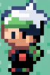 | 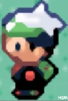   |  

```gml
FX_HQ4x(enabled, smoothness, sharpness, resolution);
```

| Name | Type | Description |
|---|---|:---|
| enabled | Bool | Defines whether the effect starts active or not. |
| smoothness | Real | Edges smoothness. |
| sharpness | Real | Edges sharpness. |
| resolution | Real | Compensate for varying pixel sizes. 1 = full, 0.5 = half. |

</br>


## Color Blindness Correction

Try to fix color blindness of Protanopia, Deutanopia and Tritanopia.

This effect is actually a simulation that allows you to adjust the contrast of elements in your game to make it comfortable for people with this condition.

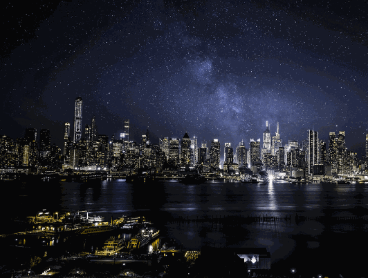

```gml
FX_ColorBlindness(enabled, mode);
```

| Name | Type | Description |
|---|---|:---|
| enabled | Bool | Defines whether the effect starts active or not. |
| mode | Real | Fix mode: 0 = Protanopia \| 1 = Deutanopia \| 2 = Tritanopia. |

</br>


## Texture Overlay

Texture to be drawn after one of the lastest rendered effects. It is drawn after the "Invert Colors" effect and before the "Lift, Gamma, Gain" effect

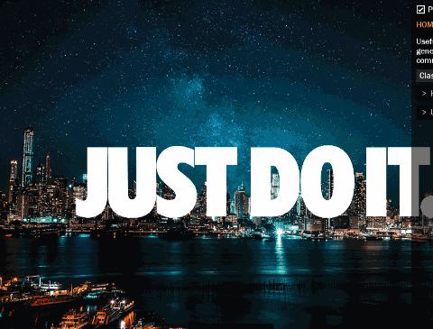

```gml
FX_TextureOverlay(enabled, intensity, scale, texture, blendmode, canDistort, tiled);
```

| Name | Type | Description |
|---|---|:---|
| enabled | Bool | Defines whether the effect starts active or not. |
| intensity | Real | Texture alpha. 0 to 1. |
| scale | Real | Texture scale. 0 to 2 recommended. |
| texture | Pointer.Texture | The texture to be used. Use `sprite_get_texture()` or `surface_get_texture()`. |
| blendmode | Real | Defines the way the texture will blend with everything below. 0 = normal, 1 = add, 2 = subtract, 3 = light. |
| canDistort | Bool | If active, the texture will distort according to the lens distortion effect. |
| tiled | Bool | If active, the texture will repeat in all directions. |

</br>


## ASCII

Transform pixel grid into texture frames, based on luminance.

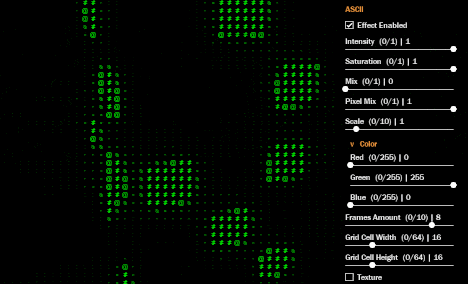

```gml
FX_ASCII(enabled, intensity, saturation, mix, pixelMix, scale, color, texture);
```

| Name | Type | Description |
|---|---|:---|
| enabled | Bool | Defines whether the effect starts active or not. |
| intensity | Real | Effect intensity. |
| saturation | Real | The grayscale control. |
| mix | Real | How much blending with the original image. |
| pixelMix | Real | How much blending big pixels with the original image. |
| scale | Real | Font scale. |
| color | Id.Color / Real | The color. |
| texture | Id.Texture | The characters texture. It must be horizontal sequential. **WARNING:** Pay attention if the texture page has the "automatically crop" option enabled, as this changes the size of the sprite. Painting the transparent area black prevents this. |

</br></br>

© Copyright notice: Images displayed in this session are for demonstration purposes only. Copyright belongs to their respective owners.
