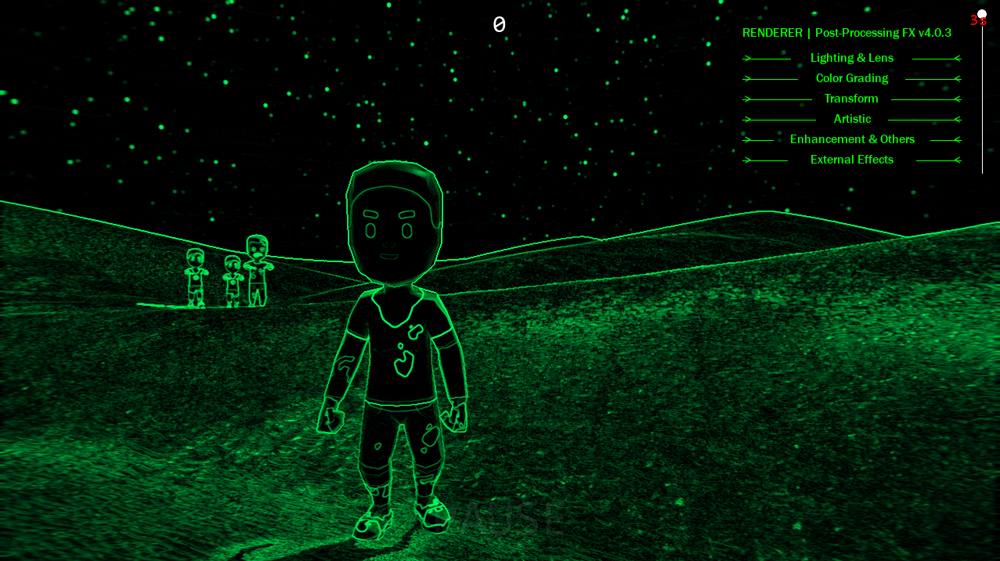
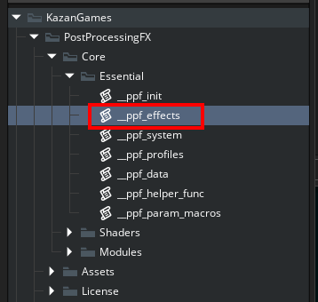
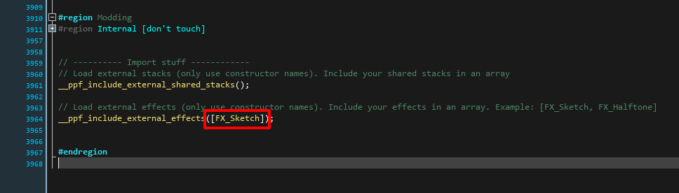
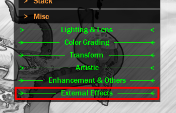

## Adding External Effects <!-- {docsify-ignore} -->

Post-Processing FX allows you to add external effects (add-ons) that you can create and use yourself, or use what we produce.


<a href="https://foxyofjungle.itch.io/sketch-cartoon-shader" target="_blank">Sketch Shader</a> add-on.

### Import the .yymps Package

To be able to use the external effect, import the .yymps package into your game. Use the `Tools > Import Local Package` menu in GameMaker.

### Import the Effect

Now import the effect into Post-Processing FX so that it is recognized.
All you need to do is:

1 - Add the effect to external effects. To do this:  
Press **CTRL + T** and search for `__ppf_effects`;



2 - Press CTRL + M to close all code regions and locate the "Modding" region;

3 - You will use the `__ppf_include_external_effects` function to include effects to PPFX.

4 - Add the effect like this: `__ppf_include_external_effects([FX_Sketch])`;



Note that external effects also appear in the Debug UI, under a tab called "External Effects":




### Technical details:

With this, the effect will already be recognized by Post-Processing FX and you will be able to use it normally like any other effect.
However, there are some important things to note:

1 - To refer to the effect, use `FX_EFFECT_EXT` instead of `FX_EFFECT`
Example:
```gml
FX_EFFECT_EXT.SKETCH
```
Note that the effect name is everything that comes after "FX_". So: `FX_Sketch` > `Sketch`. Additionally, all letters become capital letters: `SKETCH`.

2 - The parameters accompany the effect, and you can use them normally. Example: `PP_SKETCH_WHITE_AMOUNT`

