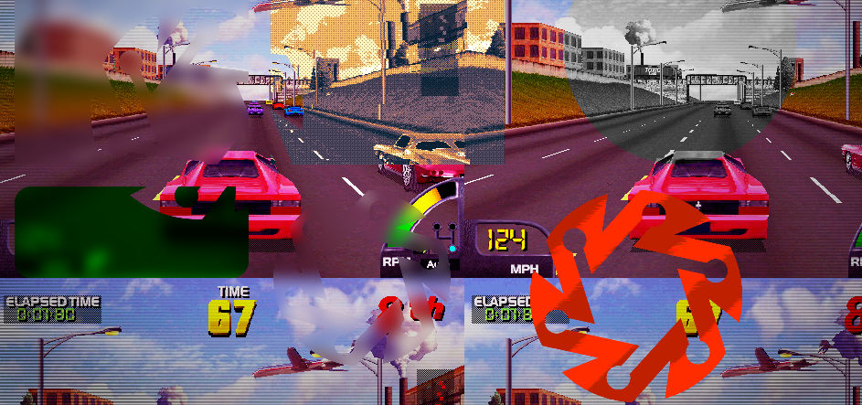
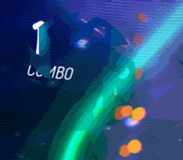
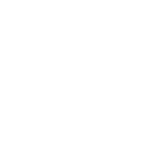
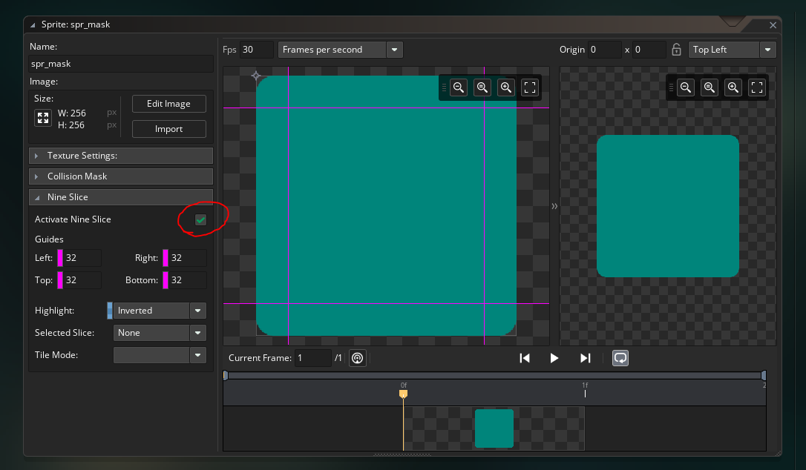
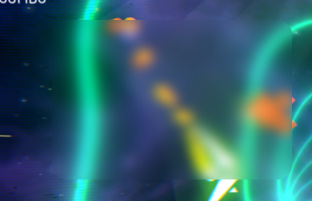
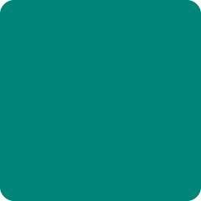

## Using Area Masks <!-- {docsify-ignore} -->

Uses the final image texture from the post-processing renderer as the texture for what to draw next.



> This feature is intended for UI use only.

</br>


## Introduction <!-- {docsify-ignore} -->

All you need to do is:  

1 - Call `ppfx_area_mask_begin()`;  
2 - Draw things;  
3 - Call `ppfx_area_mask_end()`.  

If for example you draw a sprite after calling ppfx_area_mask_begin(), the alpha channel of the sprite will be taken into account, but using the PPFX texture for the color.  

You can draw multiple things after calling this function, using the same renderer texture. You can call this function multiple times for the same renderer.

Real example:  

**Draw GUI Event:**

```gml
var _xx = 0;
var _yy = 0;
var _ww = display_get_gui_width();
var _hh = display_get_gui_height();

ppfx_area_mask_begin(blurRenderer, _xx, _yy, _ww, _hh);
draw_rectangle(20, 20, 20+256, 20+256, false);
draw_sprite_stretched_ext(sprAreaMask2, 0, 20, 300, 256, 100, c_lime, 1);
draw_sprite_ext(sprPPFXIcon, 0, 400, 400, 0.25, 0.25, -current_time*0.1, c_white, 1);

ppfx_area_mask_begin(orangeRenderer, _xx, _yy, _ww, _hh);
draw_rectangle(300, 20, 300+256, 20+256, false);

ppfx_area_mask_begin(grayscaleRenderer, _xx, _yy, _ww, _hh);
draw_sprite_stretched_ext(sprAreaMask, 0, 620, 20, 256, 256, c_white, 1);

ppfx_area_mask_end();
```

Note that the sprite will be drawn normally, but because the renderer's final surface will have the size of the `application_surface` (generally), if the GUI size is different, you may encounter distortions due to the size passed to `ppfx_area_mask_begin()`.


Dynamic shapes:



Mask used:




> Tip: You can enable the Nine Slices option on the sprite for a perfect glass!







