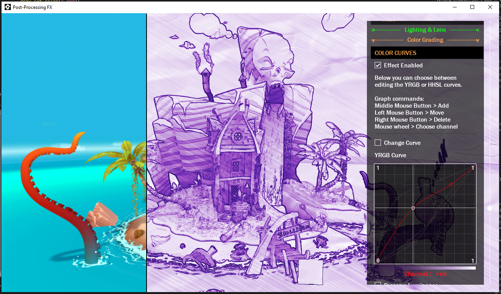
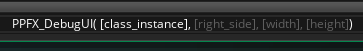
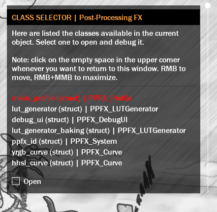
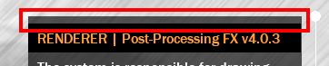

## Debugging <!-- {docsify-ignore} -->



Post-Processing FX has a debug interface (UI), which is an editor that allows you to edit effects in real time, for easy manipulation.

### Creating Editor

All you need to do is create the interface in Create Event:
```gml
debug_ui = new PPFX_DebugUI();
```



Note that the PPFX_DebugUI constructor has as its first parameter the instance of a PPFX class that you want to inspect.  

You can directly access the post-processing renderer by referencing it:
```gml
debug_ui = new PPFX_DebugUI(ppfx_id);
```
Otherwise, you will automatically go to the Class Selector screen, where the UI will automatically search for classes to be inspected in the current context (example, in the Create Event of `obj_post_processing`).



An interesting feature of the debug UI is that you can click on the top corner whenever you want to return to this screen. 



You can also use the following commands while hovering over this area:
```
> Left Mouse Button: Go to Class Selector screen;
> Right Mouse Button: Move UI;
> Right + Middle mouse button: Maximize UI (to the left or right);
```

</br>

### Drawing Editor

And then, draw the UI in Draw GUI (any) or Post-Draw:

```gml
debug_ui.Draw();
```

> Note that when drawing in Draw GUI, it is possible to scale the size of the UI, whereas in Post-Draw, the UI uses a 1:1 scale of the window (useful for Pixel-Art games).
