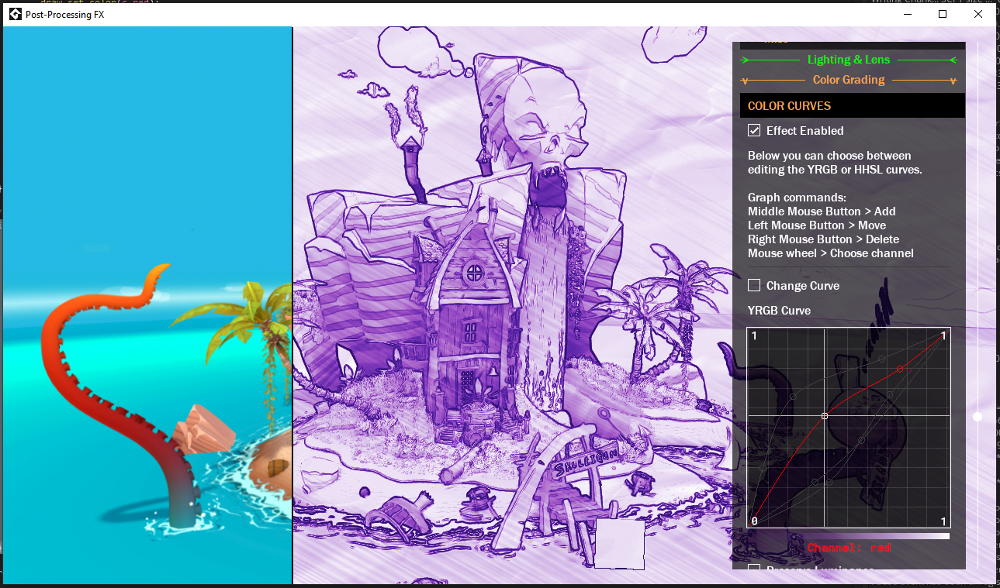
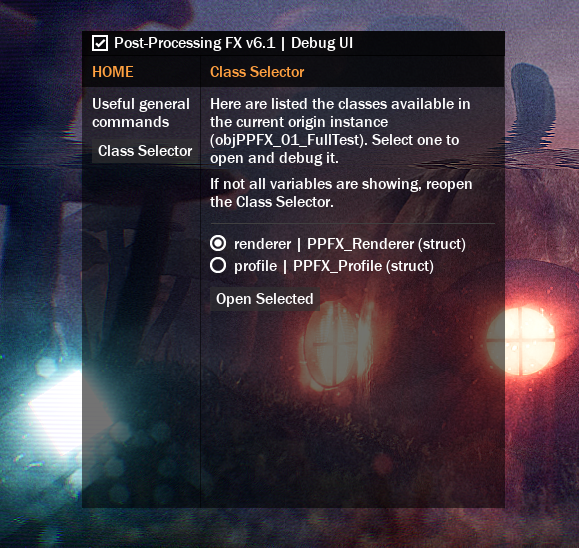

## Debugging <!-- {docsify-ignore} -->



Post-Processing FX has a debug interface (UI), which is an editor that allows you to edit effects in real time, for easy manipulation.

### Creating Editor

All you need to do is create the Debug UI in Create Event, or Room Start, for example:
```gml
ppfx_debug_show(true, id);
```

| Name | Type | Description |  
|-----------|:-----------:|-----------:|  
| show | Bool | If true, the UI will be created. If false, the existing UI will be destroyed. |  
| originInstance | Id.Instance | The origin instance to find Crystal constructors to inspect. Example: id, to find from self instance. |  
| classInstance | Struct | The struct returned from a constructor/class. Let it blank/undefined if you want the Debug UI to search it for you, in the current object/context. | 
| isOpened | Struct | If true, the UI starts opened. |  
| startMaximized | Struct | Windows will appear maximized. Disable this if you want to set custom size and position. |  
| width | Real | The start width of the Debug UI. |  
| height | Real | The start height of the Debug UI. |  
| x | Real | The start x of the Debug UI. |  
| y | Real | The start y of the Debug UI. |  

Note that the function has as a parameter, the instance of a PPFX class that you want to inspect. You can directly access the post-processing renderer by referencing it:
```gml
ppfx_debug_show(true, id, renderer);
```
Otherwise, you will automatically go to the "Class Selector" screen, where the UI will automatically search for classes to be inspected in the current context (example, in the Create Event of `objPostProcessing`).



</br>

Note that this UI is an object, but it only exists when you call the function to create the UI, like we did above. Otherwise, there is zero usage of game resources (CPU, GPU and RAM).
