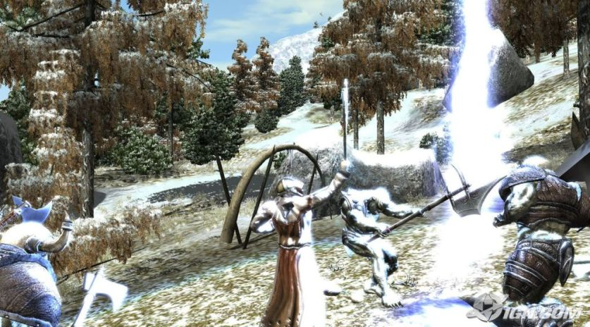
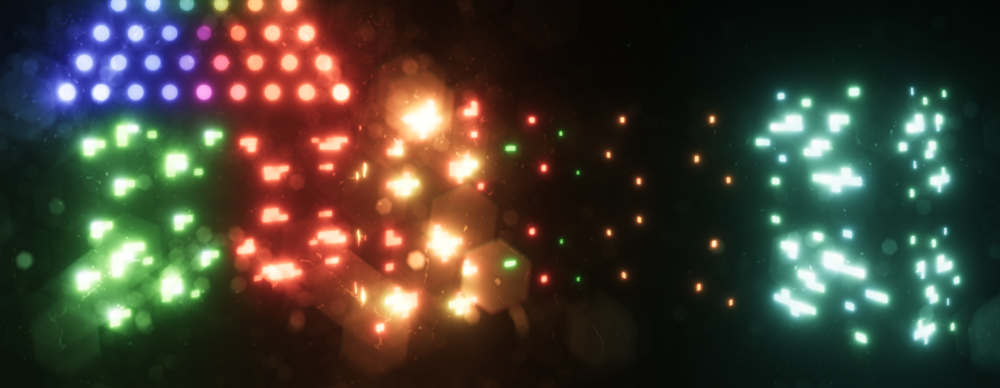

## How To Use HDR and Bloom <!-- {docsify-ignore} -->

This guide explains EVERYTHING (literally) you need to know to use Bloom and sunshafts on specific pixels.

## What is HDR? <!-- {docsify-ignore} -->

HDR stands for "High Dynamic Range". 
https://en.wikipedia.org/wiki/High_dynamic_range

When we refer to this term here, we are not necessarily referring to the HDR of the monitor.  

Rather, with HDR, textures can have more precision, allowing the Bloom effect to reach more pixels than what you see on the screen.  

Without HDR, textures have pixels ranging from 0 to 1 (or 0 to 255) - you can test yourself with a color picker. A.K.A.: LDR - Low Dynamic Range.  

With HDR, you can have much larger ranges, something like 0 to ~65000... depending on the chosen texture format.  

This allows you to apply glow to only the desired pixels, without touching the rest of the game art (since normal pixels goes from 0 to 1).  

Without HDR, the bloom threshold only reaches pixel intensities from 0 to 1.  

By default, Post-Processing FX comes with HDR DISABLED for each renderer. If you want HDR, you need to enable it in each PPFX_Renderer() that requires HDR.
Note that this increases memory usage, but not much.

To enable it, use like this:
```gml
renderer = new PPFX_Renderer(); // create renderer, like normally
renderer.SetHDREnable(true); // enable HDR, so the the Bloom effect can reach more pixel intensities than 0 - 1
```

</br>


## What is Emission? <!-- {docsify-ignore} -->

"Emission/emissive" is something that is visible without being affected by lighting. It doesn't necessarily need to glow (although that's usually the goal).  

This should be drawn on the screen without the influence of light, as it is the light itself.  

EXAMPLE: https://www.youtube.com/watch?v=Q45HW6hsJzQ

The `application_surface` by default does not support HDR, so you can't have emission out of the box, currently.  

So you have two options:  

Either use the **Crystal Lighting Engine**, 
https://foxyofjungle.itch.io/crystal-2d-lighting-engine

This lighting system supports emissive materials and HDR too, and was made by the same creator of Post-Processing FX, and both are made for each other :)

or use the **REZOL** library:
https://foxyofjungle.itch.io/rezol

You can use both together! :)

In practice, to make something emissive glow, you need to increase the EXPOSURE of pixels in a shader. For example:
```gml
vec3 colTex = texture2D(gm_BaseTexture, uv).rgb * u_emission;  // <<< pixel * exposure (emission)
```

> Any "emission" value GREATER than the Bloom/Sunshafts "threshold" will emit glow. THIS IS THE MOST IMPORTANT THING YOU NEED TO KNOW.  

With HDR, you can for example set the Bloom threshold to 1.5, and only emissive pixels above that value will start to glow. 2 as emission is a good test emission value.  

In the past, it was standard for all games to not support HDR, such as Elder Scrolls Oblivion, where the bloom reaches areas where it shouldn't, just because the pixels are bright:
LOOK!


*Copyright (C) Bethesda Game Studios, 2006. Used for demonstration purposes only.*  

With HDR, even if there are WHITE pixels on the screen, they only go up to 1 intensity generally, and if the Bloom threshold is 1.5, only intensities above that will shine/glow.  

You can also use the same concept for the Sunshafts/Godrays effect! It works like the bloom effect too.  

Note that additive pixels add up, and they can hit the Bloom threshold! That's why "1.5" as the Bloom's "threshold" is better than "1", to avoid this. Especially if you use particles with additive blendmode.  

With Post-Processing FX, you can get a Bloom effect as good as Unreal Engine 5.  


*(Bloom effect from Post-Processing FX)*

</br>


## Popped Colors and Tone Mapping <!-- {docsify-ignore} -->

The tone mapping effect aims to map the HDR (high dynamic range) range to LDR (low dynamic range).  

When using the Bloom/Sunshafts effect and others, you will notice that the colors are a little blown out. This is normal when you add pixels to the image additively (this also happens with additive particles).  

To fix this, use the `FX_ToneMapping()` effect. "ACES (Academy Color Encoding System)" and "Reinhard" are the best in my opinion.  

**"ACES" preserves white.**  
**"Reinhard" preserves hue** - but you may notice that blue colors look "strange", and this is expected (just see other game engines). Though, not really a big issue IMO.  

These tone mapping effects usually take away some of the whiteness or saturation, as a consequence of HDR, so you can adjust this using the "white" parameter, or use other PPFX effects, like Contrast, Saturation, etc.  

Tone mapping should be applied last, after the bloom/godrays effect (by default).
The "tone mapping" effect is part of the "color grading" stack.  

</br>


## Conclusion <!-- {docsify-ignore} -->

That's all you need to know to make Bloom/Sunshafts shine only on the pixels you want. Look at the sunshafts and other examples in the .yyz project of Post-Processing FX. 
